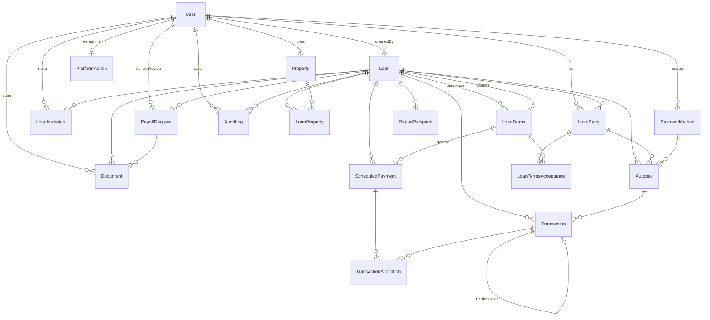

# PayMyLoan — Database & Backend Design

> **Estado**: Propuesta técnica para revisión. No implementada. No se ejecutó ninguna migración ni se modificó `schema.prisma` real como parte de este documento.
> **Fuentes analizadas**: código actual de `paymyloan-back` (commit de trabajo al 2026-09-01), código del proyecto `Owner`, documento de alcance `paymyloan-alcance.html` v0.1.

---

## 1. Objetivo

Diseñar el modelo de datos y la capa de servicios de PayMyLoan como una **plataforma general de servicing de préstamos privados garantizados con inmuebles**, capaz de manejar múltiples prestamistas, prestatarios, propiedades y préstamos — a diferencia de Owner, que fue construido para una sola inmobiliaria con un modelo de perfiles fijo (Seller/Buyer/Agent/Renter) atado a esa operación.

El principio rector de todo el documento es uno solo: **el rol de negocio de una persona no es un atributo de la persona, es un atributo de su participación en un préstamo específico**. Esto se traduce en la relación `User → LoanParty → Loan`, y todas las decisiones de este documento (autorización, aceptación de términos, permisos de documentos, reportes) se derivan de esa relación, nunca de un campo `role` global.

Este documento cubre: inventario del código actual, inventario de Owner con clasificación REUSE/ADAPT/NEW/REMOVE, el modelo de datos propuesto completo, funciones/servicios, endpoints, autorización, y una propuesta de `schema.prisma`. No se implementa nada todavía.

---

## 2. Análisis del proyecto actual (`paymyloan-back`)

Resumen de lo verificado en el código (ver inventario completo obtenido por investigación directa del repositorio):

- **Stack**: Next.js 16 (App Router, sin UI — backend puro, `output: "standalone"`), TypeScript estricto, Prisma 6.19 + PostgreSQL 16, Zod 4 para validación, bcryptjs para hashing, pnpm.
- **Schema actual**: un único modelo, `User` (`id, name, email, password, twoFactorSecret, isTwoFactorEnabled, deletedAt, createdAt, updatedAt`), mapeado a la tabla `users`. Sin enums, sin relaciones, sin `role`. Esto **confirma y valida** la premisa del documento de alcance: el rol de negocio no vive en `User`.
- **Arquitectura en capas ya establecida** y que este diseño debe respetar: `route.ts → controller → service → Prisma`, con `AppError`/`handleRouteError` para errores, `apiSuccess`/`apiError` como único formato de respuesta, Zod como única fuente de validación, y un patrón `SafeUser`/`toSafeUser()` para nunca exponer campos sensibles — patrón que se debe replicar para cualquier entidad nueva con campos sensibles (p. ej. `PaymentMethod`, `Autopay`).
- **API existente**: solo `GET /api/health`, `POST /api/users`, `PATCH /api/users/:id`, `DELETE /api/users/:id` (soft-delete). No hay `GET /api/users` ni `GET /api/users/:id`.
- **Convención de tablas**: modelos en PascalCase singular, `@@map` a snake_case plural (`users`). Este documento sigue esa convención para todas las tablas nuevas.

### ⚠️ Discrepancia detectada frente a lo indicado en el encargo

El encargo indica *"Actualmente la creación/autenticación de usuarios ya está implementada en PayMyLoan"*. La revisión del código muestra que **solo el modelo de datos y el CRUD básico de `User` existen**. No hay login, no hay sesión (JWT/cookies), no hay flujo de 2FA (solo las columnas), no hay recuperación de contraseña, no hay invitaciones. Esto se documenta en detalle en la sección **21. Discrepancies / Decisions Required**, porque afecta directamente el diseño de `LoanInvitation` (sección 5.4): el flujo de aceptación de invitación necesita enganchar con un mecanismo de creación de cuenta/login que **todavía no existe** y que queda fuera del alcance de este documento (es de datos, no de autenticación), pero que es un bloqueante de implementación a nivel de secuencia de trabajo.

---

## 3. Análisis de Owner

Inventario completo (obtenido por investigación directa del repositorio `Owner`). Se resume aquí lo relevante; el detalle campo por campo de cada modelo de Owner citado se usa como base de comparación en la sección 16.

- **Stack**: Next.js 16, NextAuth v5 beta (Credentials + TOTP vía `@otplib`), Prisma 5, PostgreSQL, Stripe SDK (`stripe@22`), AWS SDK S3, `@react-pdf/renderer`, `papaparse`. **Sin proveedor de email transaccional** — todo notifica vía webhooks hardcodeados a GoHighLevel.
- **Modelo de identidad**: `User.role` es un enum global de solo `ADMIN | STAFF | USER` (default `ADMIN`, cuestionable). La identidad funcional real (Seller/Buyer/Agent/Renter/WebUser) se determina por **qué perfiles 1:1 opcionales tiene relacionados**, no por el campo `role`. Es decir, Owner *ya* evita usar `role` como fuente de autorización de negocio — solo que su mecanismo (perfiles fijos y exclusivos por persona) tampoco sirve para PayMyLoan, porque una misma persona en Owner no puede ser Buyer en un contrato y Seller en otro con el mismo perfil (aunque en teoría podría tener ambos perfiles simultáneos, el modelo no está pensado para que el rol cambie *por transacción*).
- **`Property`**: modelo de 60+ campos orientado 100% a marketing inmobiliario (bilingüe, SEO, galería, showings, comisiones de agente, campos de renta). Confirma que **no debe copiarse**.
- **`Contract` / `Payment`**: el core financiero real. `Contract` mezcla identidad del préstamo + términos (`principalAmount`, `interestRate`, `termInYears` — sin versionado, editable in place). `Payment` mezcla calendario y transacción real en una sola tabla (`paymentDate, totalDue, principal, interest, status, paidAt, stripePaymentIntentID`) — **esta es la limitación central que el alcance pide corregir**, y este diseño la corrige separando `ScheduledPayment` de `Transaction`.
- **Amortización**: fórmula PMT francesa estándar, duplicada de forma inconsistente en 3 lugares (`lib/actions.ts`, `app/actions/import-contract.ts`, importación CSV). Incluye un comportamiento explícitamente dañino para PayMyLoan: **auto-marca como `PAID` cualquier fila cuya fecha sea anterior a hoy**, incluso en la generación inicial de un contrato nuevo. Esto sirve para migrar contratos viejos y es **incorrecto para un préstamo que nace hoy** — se elimina en el diseño nuevo.
- **Stripe**: un único Checkout Session (`mode: 'payment'`, `payment_method_types: ['card', 'us_bank_account']`) para pagos sueltos. El webhook **solo escucha `checkout.session.completed`** y marca `PAID` de inmediato — no maneja el ciclo asíncrono de ACH (`processing → succeeded/failed`, devoluciones). **No existe Stripe Connect, cuentas conectadas ni `application_fee`** — todo el dinero entra a una única cuenta de la plataforma. Esto confirma que el mecanismo de reparto hacia múltiples prestamistas debe construirse desde cero.
- **S3**: genera URL firmada de subida (PUT, 60s) pero **construye y persiste una URL pública sin firmar** para lectura (`https://{bucket}.s3.amazonaws.com/{key}`), sin `GetObjectCommand` ni URL firmada de lectura en ningún punto del código. Borrar un `MediaFile` en BD nunca borra el objeto en S3 (huérfanos). Ambos comportamientos son incompatibles con "documentos privados por préstamo" y deben corregirse.
- **`AuditLog`**: buen diseño base (actor opcional + actor externo por teléfono, `entityType/entityId`, `details` de texto libre), pero con cobertura muy desigual: cubre bien el dominio `Property`, y **no audita ni un solo evento financiero** (ni el webhook de Stripe, ni login, ni cambios de 2FA, ni creación/eliminación de usuarios).
- **Invitaciones (`VerificationToken` + `/welcome/[token]`)**: flujo completo, correcto y reutilizable como *patrón* — token aleatorio de un solo uso, expiración, formulario de contraseña, autologin con soporte de 2FA. Se reutiliza el patrón, no el modelo genérico tal cual (ver sección 5.4).
- **2FA TOTP**: implementación limpia con `@otplib` + `qrcode`, secreto en texto plano en BD (deuda técnica a evaluar, fuera de alcance de este documento porque el 2FA ya es responsabilidad de `paymyloan-back` existente).
- **PDF**: `@react-pdf/renderer`, generación 100% client-side, sin persistencia del PDF. Único documento generado hoy: tabla de amortización completa. Reutilizable como enfoque técnico; hace falta generación server-side para reportes programados y para el certificado/carta de payoff.

El detalle campo-por-campo de cada modelo de Owner queda documentado en el inventario de investigación y se referencia puntualmente en la sección 16 (tabla REUSE/ADAPT/NEW/REMOVE).

---

## 4. Decisiones de arquitectura

Estas son las decisiones estructurales que gobiernan todo el modelo. Cada una está justificada porque cambia el resto del diseño si se decide distinto — por eso se listan antes de entrar al detalle de tablas.

| # | Decisión | Justificación |
|---|---|---|
| D1 | El rol de negocio vive exclusivamente en `LoanParty`, nunca en `User`. | Requisito explícito del encargo y ya validado por el estado actual de `paymyloan-back` (no hay `role` en `User`). |
| D2 | La relación Loan↔Property es **muchos a muchos** vía tabla `LoanProperty`, no una FK directa `Loan.propertyId`. | El alcance deja explícitamente abierta la pregunta de préstamos "blanket" (una hipoteca sobre varias propiedades, Q12 del documento de alcance). Modelar N:M desde el día uno cuesta lo mismo que 1:N para el caso común (un solo registro en la tabla puente) y evita una migración estructural después. |
| D3 | Los términos comerciales del préstamo (monto, tasa, estructura, plazo, fechas, mora) viven en `LoanTerms`, **no en `Loan`**. `Loan` solo contiene identidad, estado del ciclo de vida y punteros de caché. | Es la única forma de que el versionado (v1, v2, v3…) sea real: si los campos financieros vivieran en `Loan`, "una nueva versión reabre la aceptación" no tendría dónde vivir sin mutar el registro histórico. |
| D4 | La aceptación de términos vive en una tabla dedicada `LoanTermsAcceptance` (no en `LoanTerms` ni en `LoanParty`). | Ver análisis completo en sección 5.5 — es la pieza de diseño más importante del documento. |
| D5 | Existe una entidad `LoanInvitation` separada de `LoanParty`. | `LoanParty.userId` no puede ser nulo si `LoanParty` es la tabla de autorización real; pero al invitar a alguien por correo puede que esa persona no tenga cuenta todavía. `LoanInvitation` resuelve el estado "invitado, sin cuenta aún" sin ensuciar `LoanParty` con nulabilidad condicional. |
| D6 | `ScheduledPayment` (lo que se debe) y `Transaction` (lo que ocurrió) son tablas distintas, unidas por `TransactionAllocation`. | Es la corrección central señalada tanto por el encargo como por el propio documento de alcance frente al `Payment` monolítico de Owner. Detalle en sección 5.6–5.8. |
| D7 | `Loan.currentPrincipalBalance` es un campo **cacheado/derivado**, no la fuente de verdad. La fuente de verdad es el libro mayor (`ScheduledPayment` + `Transaction` + `TransactionAllocation`). | Sin caché, calcular el saldo en cada lectura de dashboard implica sumar potencialmente cientos de transacciones. El caché se recalcula transaccionalmente dentro de `applyTransaction()`/`reverseTransaction()`, nunca se edita directo. |
| D8 | Existe una entidad `PlatformAdmin` separada, no un campo `User.role = ADMIN`. | El "Admin/Operador" del alcance es un permiso genuinamente global (opera la plataforma, no un préstamo), a diferencia de Lender/Borrower/Viewer que son inherentemente relativos a un préstamo. Esto no contradice D1: son dos categorías de permiso distintas por naturaleza. Se modela aparte para no tocar `User` y para tener trazabilidad de quién otorgó el privilegio. |
| D9 | Toda operación con efectos externos idempotentes (Stripe) pasa primero por una tabla `WebhookEvent` con `externalEventId` único, antes de tocar `Transaction`. | Un `PaymentIntent` único no es suficiente: el mismo `PaymentIntent` genera múltiples eventos (`processing`, `succeeded`, `failed`) y cada evento debe procesarse una sola vez. Ver sección 15. |
| D10 | El pricing/modelo de cobro de la propia plataforma (Sección 8 del alcance) **no se modela** en este documento. | Es una pregunta explícitamente abierta en el alcance (Q5). Inventar un modelo de facturación sin decisión de negocio violaría la instrucción de no inventar respuestas. Ver sección 19 (Preguntas pendientes). |

---

## 5. Modelo de datos

Convenciones aplicadas a todas las tablas nuevas: `id String @id @default(cuid())` (igual que `User`), `createdAt DateTime @default(now())`, `updatedAt DateTime @updatedAt` (salvo tablas de solo-inserción como `AuditLog`/`TransactionAllocation`, que no se actualizan nunca), `@@map` a snake_case plural, eliminado lógico (`deletedAt`/`status`) en vez de `DELETE` físico para cualquier tabla con relevancia financiera o legal.

### 5.1 User (existente — sin cambios de forma)

No se rediseña. Se documenta aquí solo para dejar explícitas las relaciones inversas que las nuevas tablas requieren (adición pura, no rompe nada existente).

| Campo | Tipo | Obligatorio | Notas |
|---|---|---|---|
| id | String (cuid) | Sí | ya existe |
| name | String | Sí | ya existe |
| email | String | Sí (único) | ya existe |
| password | String | Sí | ya existe, hash bcrypt |
| twoFactorSecret | String | No | ya existe |
| isTwoFactorEnabled | Boolean | Sí | ya existe, default false |
| deletedAt | DateTime | No | ya existe, soft delete |

**Regla de negocio nueva que depende de este campo, sin tocar el schema**: al aceptar una `LoanParty` con `role = LENDER`, el servicio `acceptLoanTerms()`/`joinLoanAsParty()` debe verificar `user.isTwoFactorEnabled === true` y rechazar la operación si no — el alcance exige 2FA obligatorio para prestamistas. Esto es una regla de servicio, no un constraint de base de datos (Postgres no valida condicionalmente contra el rol de una tabla relacionada sin un trigger, y no se justifica un trigger para esto).

### 5.2 Property

Modelo mínimo orientado a garantía, no a marketing. Se descarta explícitamente todo lo que Owner tiene de bilingüe, SEO, galería, showings y comisión de agente.

| Campo | Tipo | Obligatorio | Notas |
|---|---|---|---|
| id | String (cuid) | Sí | PK |
| addressLine1 | String | Sí | |
| addressLine2 | String | No | unidad/suite |
| city | String | Sí | |
| state | String(2) | Sí | código de estado US |
| postalCode | String | Sí | |
| county | String | No | relevante para jurisdicción del deed of trust |
| propertyType | enum PropertyType | Sí | ver sección 8 |
| parcelNumber | String | No | APN, cuando aplica |
| createdByUserId | String → User | Sí | quién dio de alta la propiedad |
| deletedAt | DateTime | No | soft delete; bloqueado por regla de negocio si está atada a un `Loan` no cancelado |

Campos deliberadamente **excluidos** (y por qué): `latitude/longitude` (no aporta a servicing, solo a mapas de marketing), `legalDescription` (útil solo si se generan documentos legales automáticamente desde texto estructurado; hoy los documentos son PDFs subidos, no generados — se deja como campo futuro, ver sección 19), cualquier campo de precio de venta/renta (ese dato vive en `LoanTerms.principalAmount`, no en la propiedad).

### 5.3 Loan

Contenedor de identidad y ciclo de vida. Deliberadamente **no** contiene monto, tasa ni estructura — eso vive en `LoanTerms` (ver D3).

| Campo | Tipo | Obligatorio | Notas |
|---|---|---|---|
| id | String (cuid) | Sí | PK |
| loanNumber | String | Sí (único) | identificador humano, ej. `PML-2026-000123` |
| status | enum LoanStatus | Sí | default `DRAFT` |
| createdByUserId | String → User | Sí | quién capturó el préstamo |
| currentTermsId | String → LoanTerms | No (único) | puntero a la versión de términos vigente |
| currentPrincipalBalance | Decimal(14,2) | No | caché derivado, ver D7 |
| nextPaymentDueDate | DateTime | No | caché derivado para dashboards |
| activatedAt | DateTime | No | cuándo pasó a `ACTIVE` |
| paidOffAt | DateTime | No | cuándo se cerró por payoff |
| cancelledAt | DateTime | No | cuándo se canceló antes de activar |

`Loan` **no** referencia `Property` directamente — la relación pasa por `LoanProperty` (D2).

### 5.4 LoanParty + LoanInvitation

**LoanParty** es la tabla de autorización y de identidad de rol. Responde directamente al requisito central del encargo: `User → LoanParty → Loan`.

| Campo | Tipo | Obligatorio | Notas |
|---|---|---|---|
| id | String (cuid) | Sí | PK |
| loanId | String → Loan | Sí | |
| userId | String → User | Sí | |
| role | enum LoanPartyRole | Sí | `LENDER`, `BORROWER`, `VIEWER` |
| isPrimary | Boolean | Sí | default `false`; ver nota de constraint abajo |
| status | enum LoanPartyStatus | Sí | default `INVITED` |
| invitedByUserId | String → User | No | nulo solo para el creador del préstamo |
| invitedAt / respondedAt / removedAt | DateTime | No | trazabilidad del ciclo de vida de la membresía |

Constraint: `@@unique([loanId, userId])` — una persona tiene como máximo una fila de participación por préstamo (si el negocio necesitara que la misma persona tenga dos roles en el mismo préstamo, sería una segunda fila con otro `role`, pero eso rompería la unicidad tal como está — **queda marcado como pregunta abierta en la sección 19** si eso debe permitirse).

**¿Uno o varios `LENDER`/`BORROWER` "primarios" por préstamo?** El encargo pide explícitamente evitar dos borrowers/lenders principales si el negocio no lo permite. La solución técnica (columna `isPrimary` + índice único parcial `WHERE role='BORROWER' AND isPrimary=true`) se puede construir, pero **Prisma no soporta índices parciales en su DSL de schema** — requeriría una migración SQL manual añadida a mano después de `prisma migrate dev`. Se documenta la solución en la sección 9, pero se marca como **OPEN QUESTION** si vale la pena implementarla ahora: el alcance no aclara si se permiten co-prestatarios/co-prestamistas (Owner sí permite co-compradores). Mientras no se resuelva, el MVP puede operar sin la restricción (cualquier `LENDER`/`BORROWER` activo puede actuar) y añadir el índice parcial después sin romper nada.

**LoanInvitation** resuelve el caso "quién invita a quien todavía no tiene cuenta" (D5), respondiendo directamente al punto 4 del encargo.

| Campo | Tipo | Obligatorio | Notas |
|---|---|---|---|
| id | String (cuid) | Sí | PK |
| loanId | String → Loan | Sí | |
| email | String | Sí | destinatario, puede no tener cuenta todavía |
| role | enum LoanPartyRole | Sí | rol ofrecido |
| invitedByUserId | String → User | Sí | |
| token | String | Sí (único) | mismo patrón que `VerificationToken` de Owner |
| status | enum LoanInvitationStatus | Sí | default `PENDING` |
| expiresAt | DateTime | Sí | |
| acceptedAt / acceptedByUserId | DateTime / String → User | No | se llenan al aceptar |

Al aceptar (`acceptLoanInvitation(token)`): si no existe `User` con ese email, se crea (reutilizando el flujo de creación de cuenta que ya existe en `paymyloan-back`, ver discrepancia de la sección 2); luego se crea la fila `LoanParty` correspondiente en estado `ACTIVE`, copiando `invitedByUserId` desde la invitación.

### 5.5 LoanTerms + LoanTermsAcceptance (versionado)

Este es el punto de diseño más delicado del documento (punto 5 del encargo). Se analizaron tres alternativas para dónde guardar la aceptación:

1. **Directamente en `LoanTerms`** (columnas `lenderAcceptedAt`, `borrowerAcceptedAt`): simple, pero no escala a más de 2 partes (¿co-borrowers?) y mezcla "la propuesta" con "quién respondió", forzando columnas nuevas por cada rol adicional.
2. **En `LoanParty`** (como sugiere literalmente la sección 7 del documento de alcance, con un campo "fecha de aceptación"): **descartado**. `LoanParty` es la membresía persistente de una persona en el préstamo — vive durante toda la vida del préstamo. Pero los términos se versionan (v1, v2, v3…) y cada versión necesita su propia aceptación de cada parte. Un solo campo de fecha en `LoanParty` no puede representar "aceptó v1, rechazó v2, aceptó v3".
3. **Tabla dedicada `LoanTermsAcceptance`** (loanTermsId + loanPartyId): **elegida**. Desacopla "pertenencia al préstamo" (`LoanParty`) de "decisión sobre una versión específica de términos" (`LoanTermsAcceptance`), permite N partes con voto propio, y dado que `@@unique([loanTermsId, loanPartyId])`, es trivial verificar si una versión ya tiene todas las aceptaciones necesarias.

Se marca como **desviación deliberada** de la redacción literal de la sección 7 del documento de alcance — documentada explícitamente en la sección 21 (Discrepancies).

**LoanTerms**

| Campo | Tipo | Obligatorio | Notas |
|---|---|---|---|
| id | String (cuid) | Sí | PK |
| loanId | String → Loan | Sí | |
| versionNumber | Int | Sí | secuencial por préstamo, único junto con `loanId` |
| structure | enum LoanStructure | Sí | `INTEREST_ONLY`, `AMORTIZED`, `BALLOON` |
| principalAmount | Decimal(14,2) | Sí | |
| interestRate | Decimal(6,3) | Sí | tasa anual, ej. `8.125` |
| dayCountConvention | enum DayCountConvention | Sí | default `THIRTY_360`; necesario para el cálculo de interés devengado en payoff (ver 5.9). Owner nunca calcula esto — es lógica **nueva**. |
| amortizationTermMonths | Int | Sí | plazo usado para calcular el PMT (30 años/360 meses en un balloon típico) |
| firstPaymentDate | DateTime | Sí | |
| paymentDueDay | Int | Sí | día del mes, 1–31 |
| maturityDate | DateTime | Sí | fecha real de vencimiento — puede ser muy anterior a lo que `amortizationTermMonths` sugeriría (balloon) |
| lateFeeType | enum LateFeeType | Sí | `FLAT` o `PERCENTAGE` |
| lateFeeAmount | Decimal(14,2) | Sí | monto fijo o porcentaje según `lateFeeType` |
| gracePeriodDays | Int | Sí | default 10 |
| calculatedMonthlyPayment | Decimal(14,2) | No | resultado cacheado del cálculo PMT, llenado al generar el calendario |
| status | enum LoanTermsStatus | Sí | default `DRAFT` |
| createdByUserId | String → User | Sí | |
| changeSummary | Text | No | qué cambió respecto a la versión anterior (obligatorio en la práctica desde v2 en adelante, pero no se fuerza a nivel de constraint) |
| supersedesId | String → LoanTerms | No (único) | apunta a la versión inmediatamente anterior; permite reconstruir el historial completo |

**Nota de diseño — por qué no hay `maturityTermMonths` separado**: se decidió no duplicar "plazo en meses" como campo independiente de `maturityDate`, porque tener ambos abre la puerta a que queden inconsistentes entre sí. `maturityDate` y `firstPaymentDate` ya determinan cuántos pagos hay en el calendario; `amortizationTermMonths` solo se usa para el cálculo del PMT (relevante en balloon, donde difiere del plazo real). Esta es exactamente la mecánica que pide la sección 7 del encargo.

**LoanTermsAcceptance**

| Campo | Tipo | Obligatorio | Notas |
|---|---|---|---|
| id | String (cuid) | Sí | PK |
| loanTermsId | String → LoanTerms | Sí | |
| loanPartyId | String → LoanParty | Sí | debe ser `LENDER` o `BORROWER` — los `VIEWER` nunca aceptan términos (regla de servicio) |
| decision | enum AcceptanceDecision | Sí | `ACCEPTED` / `REJECTED` |
| decidedAt | DateTime | Sí | |
| ipAddress | String | No | |
| userAgent | Text | No | |
| comment | Text | No | comentario de rechazo, pedido explícitamente por el alcance |

Constraint: `@@unique([loanTermsId, loanPartyId])`. **Inmutable por regla de aplicación** (nunca se actualiza una fila existente — si alguien cambia de opinión después de aceptar, eso requiere una nueva versión de términos, no editar su voto).

`LoanTerms.status` pasa a `ACCEPTED` cuando existe una fila `ACCEPTED` para **cada** `LoanParty` activo con rol `LENDER` o `BORROWER` en ese préstamo. Si cualquiera de ellas es `REJECTED`, `LoanTerms.status` pasa a `REJECTED` y el creador debe proponer una nueva versión.

### 5.6 ScheduledPayment

Lo que el prestatario **debe** pagar según el calendario. Generado por `generateAmortizationSchedule()` a partir de una `LoanTerms` `ACCEPTED`.

| Campo | Tipo | Obligatorio | Notas |
|---|---|---|---|
| id | String (cuid) | Sí | PK |
| loanId | String → Loan | Sí | |
| loanTermsId | String → LoanTerms | Sí | versión que generó esta fila — crítico para cuando los términos cambian a mitad de préstamo |
| sequenceNumber | Int | Sí | único junto con `loanTermsId` |
| dueDate | DateTime | Sí | |
| principalDue | Decimal(14,2) | Sí | |
| interestDue | Decimal(14,2) | Sí | |
| totalDue | Decimal(14,2) | Sí | `principalDue + interestDue` |
| projectedRemainingBalance | Decimal(14,2) | Sí | saldo proyectado tras este pago, según el plan original |
| amountPaid | Decimal(14,2) | Sí | default 0; acumulado de asignaciones reales aplicadas |
| status | enum ScheduledPaymentStatus | Sí | default `PENDING` |
| paidInFullAt | DateTime | No | |
| lateFeeAssessed | Decimal(14,2) | Sí | default 0 |
| lateFeeAssessedAt | DateTime | No | |

**Corrección explícita respecto a Owner**: no existe ningún mecanismo de "marcar como pagado automáticamente si la fecha es anterior a hoy". Todo `ScheduledPayment` nuevo nace en `PENDING`, sin excepción — el auto-marcado de Owner es exclusivamente para migración de contratos históricos y no aplica a un préstamo que nace en la plataforma.

No existe un estado `LATE` en el enum: la morosidad se deriva comparando `dueDate + loan.gracePeriodDays` contra la fecha actual sobre filas `PENDING`/`PARTIALLY_PAID`, y se refleja como el estado `DELINQUENT` a nivel de `Loan` (ver máquina de estados en sección 20), no como un estado propio de cada fila — evita una redundancia que podría desincronizarse.

### 5.7 Transaction

Lo que **realmente ocurrió**. Registra cada movimiento de dinero, con su ciclo de vida ACH completo.

| Campo | Tipo | Obligatorio | Notas |
|---|---|---|---|
| id | String (cuid) | Sí | PK |
| loanId | String → Loan | Sí | |
| type | enum TransactionType | Sí | `SCHEDULED_PAYMENT`, `PRINCIPAL_PREPAYMENT`, `PAYOFF_PAYMENT`, `LATE_FEE_PAYMENT`, `REFUND`, `ADJUSTMENT` |
| status | enum TransactionStatus | Sí | default `PENDING`; ciclo completo `PENDING → PROCESSING → SUCCEEDED/FAILED`, más `RETURNED`, `REFUNDED`, `CANCELLED` |
| method | enum PaymentMethodChannel | Sí | `ACH`, `WIRE`, `CHECK`, `CARD`, `MANUAL` |
| amount | Decimal(14,2) | Sí | |
| currency | String(3) | Sí | default `USD` |
| stripePaymentIntentId | String | No (único) | ver sección 14 — nunca se guarda info bancaria, solo el identificador |
| stripeChargeId | String | No | |
| stripePaymentMethodId | String | No | referencia, no el método completo |
| last4 | String | No | últimos 4 dígitos, para mostrar en UI |
| failureReason / returnCode | Text / String | No | motivo de falla o código de devolución ACH (ej. `R01`) |
| isAutopay | Boolean | Sí | default false |
| autopayId | String → Autopay | No | |
| previousAttemptId | String → Transaction | No (único, self-relation) | encadena reintentos de autopay |
| initiatedByUserId | String → User | No | nulo si el origen es sistema (autopay, webhook) |
| initiatedAt / processedAt / settledAt / failedAt / returnedAt / refundedAt | DateTime | variable | hitos del ciclo de vida ACH |
| notes | Text | No | referencia manual (ej. número de wire) |

### 5.8 TransactionAllocation

**Decisión: sí es necesaria**, no se asume por defecto. Razones concretas:

1. Una sola `Transaction` (ej. un ACH de $2,500) puede cubrir mora + interés + capital de **una misma** `ScheduledPayment`, o repartirse entre **varias** (el prestatario se pone al día de dos meses de una sola vez).
2. Un abono adicional a capital puede no corresponder a ninguna fila del calendario todavía vencida.
3. El reporte fiscal anual de interés cobrado (mencionado en la sección 9 del alcance como fase 3) solo es correcto si el interés está desglosado por fila, no enterrado en el monto bruto de la transacción.

| Campo | Tipo | Obligatorio | Notas |
|---|---|---|---|
| id | String (cuid) | Sí | PK |
| transactionId | String → Transaction | Sí | |
| scheduledPaymentId | String → ScheduledPayment | No | nulo para abonos a capital no ligados a una fila específica |
| allocationType | enum AllocationType | Sí | `LATE_FEE`, `INTEREST`, `PRINCIPAL` |
| amount | Decimal(14,2) | Sí | |

Regla de negocio (aplicada en `applyTransaction()`, no como constraint de BD): `SUM(amount) WHERE transactionId = X` nunca debe exceder `Transaction.amount`. Postgres no valida esto de forma nativa sin un trigger; se documenta como riesgo controlado en la sección 18, mitigado con un job de reconciliación periódico.

### 5.9 PayoffRequest

| Campo | Tipo | Obligatorio | Notas |
|---|---|---|---|
| id | String (cuid) | Sí | PK |
| loanId | String → Loan | Sí | |
| requestedByUserId | String → User | Sí | prestatario |
| effectiveDate | DateTime | Sí | fecha de vigencia elegida |
| expirationDate | DateTime | Sí | hasta cuándo es firme la cotización |
| principalBalance | Decimal(14,2) | Sí | snapshot al momento del cálculo |
| accruedInterest | Decimal(14,2) | Sí | calculado con `dayCountConvention`, algo que Owner nunca hace |
| outstandingLateFees | Decimal(14,2) | Sí | |
| otherCharges | Decimal(14,2) | Sí | default 0 |
| totalPayoffAmount | Decimal(14,2) | Sí | |
| status | enum PayoffRequestStatus | Sí | default `REQUESTED` |
| reviewedByUserId / reviewedAt | String → User / DateTime | No | prestamista |
| rejectionReason | Text | No | |
| modifiedAmount / modificationNote | Decimal(14,2) / Text | No | ajuste del prestamista antes de aprobar |
| signedAt | DateTime | No | |
| signedByUserId | String | No | **sin FK** — ver OPEN QUESTION de firma electrónica, sección 19 |
| completedAt | DateTime | No | cuándo se cerró el préstamo usando esta cotización |

**¿Necesita versionado propio (tipo `LoanTerms`)?** No. Cada solicitud/recotización nueva es simplemente una fila nueva de `PayoffRequest` (son cotizaciones efímeras por naturaleza, no un acuerdo contractual vivo que se modifica en el tiempo). El historial completo queda preservado porque nunca se borran filas, solo se crean nuevas y/o cambian de estado. Esto evita una tabla `PayoffRequestVersion` que no aportaría nada sobre simplemente consultar `PayoffRequest WHERE loanId = X ORDER BY createdAt`.

### 5.10 Document

| Campo | Tipo | Obligatorio | Notas |
|---|---|---|---|
| id | String (cuid) | Sí | PK |
| loanId | String → Loan | Sí | documentos son privados **por préstamo** |
| payoffRequestId | String → PayoffRequest | No | para la carta de payoff específicamente |
| type | enum DocumentType | Sí | `PROMISSORY_NOTE`, `DEED_OF_TRUST`, `SETTLEMENT_STATEMENT`, `LOAN_TERMS_SNAPSHOT`, `PAYOFF_LETTER`, `STATEMENT`, `OTHER` |
| visibility | enum DocumentVisibility | Sí | default `SHARED`; `LENDER_ONLY` / `BORROWER_ONLY` / `ADMIN_ONLY` para casos restringidos |
| status | enum DocumentStatus | Sí | `ACTIVE` / `ARCHIVED` / `DELETED` (soft) |
| s3Bucket / s3Key | String | Sí | **nunca** se guarda ni se sirve una URL pública (corrige el comportamiento de Owner) |
| originalFileName / mimeType / fileSizeBytes | String / String / Int | Sí | |
| uploadedByUserId | String → User | Sí | |
| deletedAt | DateTime | No | |

Constraint: `@@unique([s3Bucket, s3Key])`. El acceso de lectura **siempre** pasa por `getDocumentDownloadUrl()`, que verifica `LoanParty` + `visibility` y genera un `GetObjectCommand` presignado de corta vida (recomendado 60–300 segundos) — funcionalidad que Owner no tiene en absoluto hoy (confirmado: cero `GetObjectCommand` en su código).

### 5.11 ReportRecipient

Reservada para **suscripciones recurrentes**, no para envíos puntuales (ver sección 13 — un envío único es una llamada a `sendReport()` + un `AuditLog`, no una fila persistente).

| Campo | Tipo | Obligatorio | Notas |
|---|---|---|---|
| id | String (cuid) | Sí | PK |
| subscribedByUserId | String → User | Sí | quién autorizó el envío |
| loanId | String → Loan | No | nulo = reporte de cartera completa del `subscribedByUserId` |
| recipientEmail | String | Sí | |
| recipientName | String | No | |
| reportType | enum ReportType | Sí | `LOAN_STATEMENT`, `PAYMENT_HISTORY`, `PORTFOLIO_SUMMARY` |
| frequency | enum ReportFrequency | Sí | `MONTHLY`, `QUARTERLY`, `ANNUALLY` |
| format | enum ReportFormat | Sí | default `PDF` |
| isActive | Boolean | Sí | default true |
| lastSentAt / nextScheduledAt | DateTime | No | |

### 5.12 AuditLog

| Campo | Tipo | Obligatorio | Notas |
|---|---|---|---|
| id | String (cuid) | Sí | PK |
| actorUserId | String → User | No | nulo si el actor es del sistema |
| isSystemActor | Boolean | Sí | default false |
| systemActorLabel | String | No | ej. `stripe_webhook`, `autopay_scheduler` |
| action | String | Sí | ver nota abajo sobre por qué no es enum |
| entityType / entityId | String / String | Sí / No | |
| loanId | String → Loan | No | denormalizado a propósito — casi todo evento se filtra por préstamo |
| metadata | Json | No | reemplaza el `details` de texto libre de Owner por estructura consultable |
| ipAddress / userAgent | String / Text | No | |
| createdAt | DateTime | Sí | **sin `updatedAt`** — un log de auditoría nunca se actualiza ni se borra |

**Por qué `action` es `String` y no un enum**: un enum obligaría a una migración de schema cada vez que se agregue un nuevo tipo de evento auditable — y este documento ya identifica ~25 eventos distintos a auditar (login, cambio de términos, ACH devuelto, descarga de documento, cambio de cuenta bancaria, etc.), con alta probabilidad de crecer. Se mantiene como `String` libre, pero **controlado a nivel de aplicación** por un union type / enum de TypeScript (no de Postgres), que da seguridad en tiempo de compilación sin fricción de migración por cada evento nuevo — mismo balance de trade-offs que ya usó Owner.

### Tablas auxiliares no listadas en el punto de partida del alcance (justificación)

| Tabla | Por qué se agrega |
|---|---|
| `LoanProperty` | Ver D2 — soporta N:M Loan↔Property sin comprometerse hoy a préstamos blanket. |
| `LoanInvitation` | Ver D5 — el alcance pide "cómo se maneja quien invita" sin resolver el caso de invitado sin cuenta. |
| `LoanTermsAcceptance` | Ver D4 — desviación deliberada y justificada de la sugerencia literal del alcance. |
| `PaymentMethod` | Necesaria para Autopay: el "método de pago autorizado" es un recurso reutilizable entre préstamos del mismo usuario, con su propio ciclo de verificación (micro-depósitos / Financial Connections), no un campo de `Transaction`. |
| `Autopay` | El alcance lo pide explícitamente (sección 10 del encargo) como concepto con estado propio (activo/pausado/cancelado, reintentos, consentimiento). No cabe en `Loan` ni en `Transaction` sin duplicar responsabilidades. |
| `WebhookEvent` | Ver D9 — mecanismo concreto de idempotencia para webhooks de Stripe. |
| `PlatformAdmin` | Ver D8. |

---

## 6. Relaciones

Resumen de cardinalidades clave, confirmando o corrigiendo los escenarios planteados en el encargo:

- **1 usuario → múltiples préstamos, con rol distinto en cada uno**: soportado vía `LoanParty` (una fila por combinación usuario+préstamo, cada una con su propio `role`). ✅ Confirma el escenario del encargo.
- **1 préstamo → múltiples participantes**: soportado, `LoanParty` es 1:N desde `Loan`. ✅
- **1 propiedad → uno o varios préstamos**: soportado vía `LoanProperty` (N:M). El alcance no confirma si el negocio realmente necesita esto (Q12 abierta) — el modelo lo permite sin forzarlo.
- **1 préstamo → múltiples versiones de términos**: soportado, `LoanTerms` es 1:N desde `Loan`, encadenado por `supersedesId`. ✅
- **1 préstamo → múltiples scheduled payments**: soportado, 1:N. ✅
- **1 préstamo → múltiples transactions**: soportado, 1:N. ✅
- **1 transaction → una o varias allocations**: soportado, 1:N vía `TransactionAllocation`. ✅
- **1 préstamo → múltiples documentos**: soportado, 1:N. ✅
- **1 préstamo → múltiples payoff requests**: soportado, 1:N (cada solicitud/recotización es una fila nueva). ✅

Ninguno de estos escenarios contradice el alcance funcional; donde el alcance deja algo indefinido (préstamos blanket, co-borrowers/co-lenders), el modelo es permisivo por diseño pero no asume una respuesta de negocio — queda marcado como pregunta abierta.

---

## 7. ERD



---

## 8. Enums

| Enum | Valores | Notas |
|---|---|---|
| `LoanStatus` | DRAFT, PENDING_ACCEPTANCE, ACTIVE, DELINQUENT, PAID_OFF, CANCELLED | ver máquina de estados, sección 20 |
| `LoanPartyRole` | LENDER, BORROWER, VIEWER | |
| `LoanPartyStatus` | INVITED, ACTIVE, DECLINED, REMOVED | |
| `LoanInvitationStatus` | PENDING, ACCEPTED, DECLINED, EXPIRED, REVOKED | |
| `LoanStructure` | INTEREST_ONLY, AMORTIZED, BALLOON | |
| `DayCountConvention` | THIRTY_360, ACTUAL_365 | default propuesto: `THIRTY_360` (estándar en préstamo privado inmobiliario), a confirmar — sección 19 |
| `LateFeeType` | FLAT, PERCENTAGE | |
| `LoanTermsStatus` | DRAFT, PENDING_ACCEPTANCE, ACCEPTED, REJECTED, SUPERSEDED | |
| `AcceptanceDecision` | ACCEPTED, REJECTED | |
| `ScheduledPaymentStatus` | PENDING, PARTIALLY_PAID, PAID, VOIDED | `VOIDED` = superado por una nueva versión de términos antes de vencer |
| `TransactionType` | SCHEDULED_PAYMENT, PRINCIPAL_PREPAYMENT, PAYOFF_PAYMENT, LATE_FEE_PAYMENT, REFUND, ADJUSTMENT | |
| `TransactionStatus` | PENDING, PROCESSING, SUCCEEDED, FAILED, RETURNED, REFUNDED, CANCELLED | |
| `PaymentMethodChannel` | ACH, WIRE, CHECK, CARD, MANUAL | |
| `AllocationType` | LATE_FEE, INTEREST, PRINCIPAL | |
| `PaymentMethodType` | US_BANK_ACCOUNT | enum de un solo valor hoy, deja espacio para CARD futuro |
| `PaymentMethodStatus` | ACTIVE, REMOVED | |
| `PaymentMethodVerificationStatus` | PENDING_VERIFICATION, VERIFIED, FAILED | |
| `AutopayStatus` | ACTIVE, PAUSED, CANCELLED | |
| `AutopayAmountType` | SCHEDULED_AMOUNT_DUE, FIXED_AMOUNT | |
| `PayoffRequestStatus` | REQUESTED, UNDER_REVIEW, APPROVED, REJECTED, SIGNED, EXPIRED, COMPLETED, CANCELLED | |
| `DocumentType` | PROMISSORY_NOTE, DEED_OF_TRUST, SETTLEMENT_STATEMENT, LOAN_TERMS_SNAPSHOT, PAYOFF_LETTER, STATEMENT, OTHER | |
| `DocumentVisibility` | SHARED, LENDER_ONLY, BORROWER_ONLY, ADMIN_ONLY | |
| `DocumentStatus` | ACTIVE, ARCHIVED, DELETED | |
| `ReportType` | LOAN_STATEMENT, PAYMENT_HISTORY, PORTFOLIO_SUMMARY | |
| `ReportFrequency` | MONTHLY, QUARTERLY, ANNUALLY | |
| `ReportFormat` | PDF, CSV | |
| `PropertyType` | SINGLE_FAMILY, MULTI_FAMILY, CONDO, TOWNHOUSE, LAND, COMMERCIAL, OTHER | |
| `WebhookProvider` | STRIPE | |
| `WebhookEventStatus` | RECEIVED, PROCESSED, FAILED, IGNORED | |

`AuditLog.action` **no** es un enum de Postgres — ver justificación en 5.12.

---

## 9. Índices y constraints

| Tabla | PK | FKs | Unique | Índices (además de PK/unique) | onDelete relevante |
|---|---|---|---|---|---|
| `properties` | id | createdByUserId → User | — | `[createdByUserId]` | User: no aplica (no se borra User físicamente) |
| `loans` | id | createdByUserId → User, currentTermsId → LoanTerms | `loanNumber`, `currentTermsId` | `[status]` | — |
| `loan_properties` | `[loanId, propertyId]` compuesta | loanId → Loan, propertyId → Property | (la PK compuesta ya es única) | `[propertyId]` | loanId: Cascade; propertyId: Restrict (no se puede borrar una propiedad todavía atada a un préstamo) |
| `loan_parties` | id | loanId → Loan, userId → User, invitedByUserId → User | `[loanId, userId]` | `[userId]`, `[loanId, role]` | loanId: Cascade |
| `loan_invitations` | id | loanId → Loan, invitedByUserId → User, acceptedByUserId → User | `token` | `[loanId]`, `[email]` | loanId: Cascade |
| `loan_terms` | id | loanId → Loan, createdByUserId → User, supersedesId → LoanTerms | `[loanId, versionNumber]`, `supersedesId` | `[loanId, status]` | loanId: Cascade |
| `loan_terms_acceptances` | id | loanTermsId → LoanTerms, loanPartyId → LoanParty | `[loanTermsId, loanPartyId]` | `[loanPartyId]` | loanTermsId: Cascade; loanPartyId: Cascade |
| `scheduled_payments` | id | loanId → Loan, loanTermsId → LoanTerms | `[loanTermsId, sequenceNumber]` | `[loanId, dueDate]`, `[loanId, status]` | loanId: Cascade; loanTermsId: Restrict |
| `transactions` | id | loanId → Loan, autopayId → Autopay, initiatedByUserId → User, previousAttemptId → Transaction | `stripePaymentIntentId`, `previousAttemptId` | `[loanId, status]`, `[loanId, createdAt]` | loanId: Restrict (nunca se borra un préstamo con transacciones) |
| `transaction_allocations` | id | transactionId → Transaction, scheduledPaymentId → ScheduledPayment | — | `[transactionId]`, `[scheduledPaymentId]` | transactionId: Cascade; scheduledPaymentId: SetNull |
| `payment_methods` | id | userId → User | `stripePaymentMethodId` | `[userId]` | — |
| `autopays` | id | loanId → Loan, loanPartyId → LoanParty, paymentMethodId → PaymentMethod, cancelledByUserId → User | `[loanId, loanPartyId]` | `[status, nextAttemptScheduledFor]` | loanId: Cascade |
| `payoff_requests` | id | loanId → Loan, requestedByUserId → User, reviewedByUserId → User | — | `[loanId, status]` | loanId: Restrict |
| `documents` | id | loanId → Loan, payoffRequestId → PayoffRequest, uploadedByUserId → User | `[s3Bucket, s3Key]` | `[loanId, type]`, `[loanId, status]` | loanId: Cascade; payoffRequestId: SetNull |
| `report_recipients` | id | subscribedByUserId → User, loanId → Loan | — | `[loanId]`, `[subscribedByUserId]`, `[isActive, nextScheduledAt]` | loanId: Cascade |
| `audit_logs` | id | actorUserId → User, loanId → Loan | — | `[loanId, createdAt]`, `[actorUserId, createdAt]`, `[entityType, entityId]` | loanId: SetNull (el log sobrevive aunque el préstamo se elimine, análogo al `propertyId` suelto de Owner) |
| `webhook_events` | id | — | `externalEventId` | `[status]` | — |
| `platform_admins` | id | userId → User, grantedByUserId → User | `userId` | — | — |

**Consultas de acceso frecuente y el índice que las resuelve** (pedidas explícitamente en el encargo):

- *Todos los préstamos de un usuario*: `LoanParty.userId` (índice `[userId]`) → join a `Loan`.
- *Todas las partes de un préstamo*: `LoanParty.loanId` (cubierto por `[loanId, role]`).
- *Todos los pagos programados de un préstamo*: `ScheduledPayment.loanId` (índice `[loanId, dueDate]`, ya ordenado para el calendario).
- *Todas las transacciones de un préstamo*: `Transaction.loanId` (índice `[loanId, createdAt]`).
- *Todos los documentos de un préstamo*: `Document.loanId` (índice `[loanId, type]`).

**Constraints para evitar situaciones inválidas** (pedidas explícitamente en el punto 18 del encargo):

| Situación a evitar | Mecanismo propuesto | Nivel |
|---|---|---|
| Dos `BORROWER`/`LENDER` "principales" en el mismo préstamo | Índice único parcial `ON loan_parties (loanId) WHERE role='BORROWER' AND isPrimary=true` (ídem para LENDER) | DB, vía migración SQL manual (Prisma no soporta índices parciales en su DSL) — **condicionado a resolver la OPEN QUESTION** de si co-borrowers/co-lenders son un caso real |
| Aceptación duplicada de la misma versión por la misma parte | `@@unique([loanTermsId, loanPartyId])` en `LoanTermsAcceptance` | DB |
| Términos modificados después de aceptados | No hay `UPDATE` expuesto sobre `LoanTerms` una vez `ACCEPTED` — se aplica a nivel de servicio (el service layer nunca llama `.update()` sobre una fila `ACCEPTED`); a nivel de DB no hay forma nativa de "congelar" una fila sin trigger, se acepta el riesgo controlado (ver sección 18) | Servicio |
| Transacciones duplicadas por reintento de webhook | `WebhookEvent.externalEventId` único — el evento se descarta si ya existe antes de tocar `Transaction` | DB |
| `PaymentIntent` duplicado | `Transaction.stripePaymentIntentId` único | DB |
| Documento duplicado en la misma ruta S3 | `@@unique([s3Bucket, s3Key])` en `Document` | DB |
| Doble invitación activa a la misma persona para el mismo préstamo | **No forzado a nivel de DB** — `LoanInvitation` no tiene unique en `[loanId, email]` porque una invitación expirada/rechazada debe poder reemplazarse por una nueva; se controla a nivel de servicio (`createInvitation()` revoca cualquier invitación `PENDING` previa para el mismo `[loanId, email]` antes de crear una nueva) | Servicio |

---

## 10. Reglas de negocio

1. **2FA obligatorio para `LENDER`**: `acceptLoanTerms()`/el flujo de unión de una `LoanParty` con `role=LENDER` rechaza la operación si `user.isTwoFactorEnabled=false`.
2. **Autorización siempre vía `LoanParty` activo**, nunca vía `User` — toda consulta de negocio filtra `WHERE loanParty.userId = session.userId AND loanParty.status='ACTIVE'`.
3. **Los términos aceptados nunca se editan in place** — cualquier cambio crea una nueva fila de `LoanTerms` con `versionNumber` incrementado y `supersedesId` apuntando a la anterior.
4. **Un préstamo pasa a `ACTIVE` solo cuando su `LoanTerms` vigente está `ACCEPTED`** por todos los `LoanParty` activos con rol `LENDER`/`BORROWER` — nunca antes, y esto dispara automáticamente `generateAmortizationSchedule()`.
5. **Ningún `ScheduledPayment` nuevo nace `PAID`** — se elimina explícitamente el comportamiento de Owner de marcar como pagadas las filas con fecha pasada.
6. **Orden de aplicación de una transacción (prelación)**: mora → interés → capital, ejecutado por `calculatePaymentAllocation()` y persistido como filas de `TransactionAllocation`.
7. **Un ACH nunca se marca `SUCCEEDED` al crear el cobro** — el estado inicial es `PENDING`/`PROCESSING` y solo el webhook de Stripe lo mueve a `SUCCEEDED` (o `FAILED`/`RETURNED`), corrigiendo el defecto explícito de Owner (marca `PAID` en `checkout.session.completed` sin esperar la liquidación real).
8. **Cambio de método de pago bancario dispara notificación a ambas partes** y queda auditado (`AuditLog` con `action='BANK_ACCOUNT_CHANGED'`) — vector de fraude señalado explícitamente en el alcance.
9. **Nunca se almacena información bancaria completa** — solo identificadores de Stripe y últimos 4 dígitos (ver sección 14).
10. **Un documento nunca se sirve por URL pública** — todo acceso de lectura pasa por una URL firmada de corta vida generada bajo demanda, verificando pertenencia (`LoanParty`) y `visibility`.
11. **`AuditLog` es de solo inserción** — ninguna fila se actualiza ni se borra jamás, incluso si el `Loan`/`User` relacionado se elimina (por eso `loanId` usa `onDelete: SetNull`, nunca `Cascade`).
12. **Un `PayoffRequest` deja de ser editable al llegar a `SIGNED`** — cualquier cambio posterior requiere una solicitud nueva.
13. **El saldo cacheado (`Loan.currentPrincipalBalance`) se recalcula siempre dentro de la misma transacción de base de datos** que crea las `TransactionAllocation` correspondientes — nunca se actualiza de forma independiente.

---

## 11. Funciones / Services

Clasificación: **REUSE** (se porta casi igual), **ADAPT** (existe en Owner pero cambia de forma relevante), **NEW** (no existe en Owner).

### Users / Invitations

| Función | Propósito | Params principales | Tablas | Clase | Reglas / permisos |
|---|---|---|---|---|---|
| `createLoanInvitation(loanId, email, role, invitedByUserId)` | Invita a una persona (con o sin cuenta) a un préstamo con un rol dado | loanId, email, role | LoanInvitation | NEW | Solo `LENDER` o el creador del préstamo puede invitar `BORROWER`; cualquier `LENDER`/`BORROWER` activo puede invitar `VIEWER` |
| `acceptLoanInvitation(token, accountData?)` | Acepta invitación; crea `User` si no existe, crea `LoanParty` ACTIVE | token | LoanInvitation, User, LoanParty | NEW | Token válido y no expirado |
| `declineLoanInvitation(token, comment?)` | Rechaza invitación | token | LoanInvitation | NEW | — |
| `resendLoanInvitation(invitationId)` | Reenvía el correo con el mismo token (o uno nuevo si expiró) | invitationId | LoanInvitation | NEW | Solo quien invitó o un `LENDER` del préstamo |
| `revokeLoanInvitation(invitationId)` | Cancela una invitación pendiente | invitationId | LoanInvitation | NEW | Solo quien invitó o un `LENDER` |
| `removeLoanParty(loanPartyId)` | Retira a un `VIEWER` (o, con confirmación reforzada, a un `BORROWER`/`LENDER` secundario) | loanPartyId | LoanParty | NEW | `LENDER` del préstamo o Admin |

### Loans

| Función | Propósito | Params | Tablas | Clase | Reglas |
|---|---|---|---|---|---|
| `createLoan(data)` | Crea `Loan` DRAFT + `Property`(s) + `LoanProperty` + `LoanParty` del creador + `LoanTerms` v1 DRAFT | propertyData, loanTermsData | Loan, Property, LoanProperty, LoanParty, LoanTerms | NEW | El creador queda como `LENDER` o `BORROWER` según quién capture — el alcance permite que cualquiera de las dos partes inicie |
| `updateLoanDraft(loanId, data)` | Edita términos mientras `LoanTerms.status=DRAFT` | loanId, data | LoanTerms | NEW | Solo mientras no se ha enviado a aceptación |
| `submitLoanForAcceptance(loanId)` | `Loan→PENDING_ACCEPTANCE`, `LoanTerms→PENDING_ACCEPTANCE`, dispara invitaciones/notificaciones | loanId | Loan, LoanTerms | NEW | Requiere al menos un `LENDER` y un `BORROWER` con `LoanParty` `INVITED`/`ACTIVE` |
| `activateLoan(loanId)` | Disparado automáticamente al completarse todas las `LoanTermsAcceptance`; genera calendario | loanId | Loan, ScheduledPayment | NEW | Sistema, no expuesto directo a usuario |
| `getLoan(loanId, requestingUserId)` | Lectura autorizada | loanId | Loan + relaciones | NEW | Requiere `LoanParty` activo (cualquier rol) |
| `listLoansForUser(userId, filters)` | Lista prestamos donde el usuario participa | userId | LoanParty, Loan | NEW | — |
| `cancelLoan(loanId)` | Cancela antes de activar | loanId | Loan | NEW | Solo si `status` ∈ {DRAFT, PENDING_ACCEPTANCE} |
| `recomputeLoanDelinquencyStatus()` | Job diario: marca `ACTIVE↔DELINQUENT` según mora | — | Loan, ScheduledPayment | NEW | Sistema |
| `closeLoanAsPaidOff(loanId, payoffRequestId)` | Cierra el préstamo tras un payoff completado | loanId | Loan, PayoffRequest | NEW | `LENDER` o Admin |

### Loan Terms

| Función | Propósito | Params | Tablas | Clase | Reglas |
|---|---|---|---|---|---|
| `createLoanTermsVersion(loanId, data, createdByUserId)` | Propone nueva versión de términos | loanId, data | LoanTerms | NEW | Cualquier `LENDER`/`BORROWER` activo puede proponer; requiere `changeSummary` |
| `submitLoanTermsForAcceptance(loanTermsId)` | Pasa la versión a `PENDING_ACCEPTANCE` | loanTermsId | LoanTerms | NEW | — |
| `acceptLoanTerms(loanTermsId, loanPartyId, ip, userAgent)` | Registra aceptación; si completa el quórum, activa el préstamo | loanTermsId, loanPartyId | LoanTermsAcceptance, LoanTerms, Loan | NEW | Ver regla 2FA para `LENDER`; `LoanParty.status=ACTIVE` |
| `rejectLoanTerms(loanTermsId, loanPartyId, comment, ip, userAgent)` | Registra rechazo; marca la versión `REJECTED` | loanTermsId, loanPartyId, comment | LoanTermsAcceptance, LoanTerms | NEW | — |
| `getActiveLoanTerms(loanId)` | Devuelve la versión vigente | loanId | LoanTerms | NEW | — |

### Amortization

| Función | Propósito | Params | Tablas | Clase | Reglas |
|---|---|---|---|---|---|
| `calculateAmortizedPayment(principal, annualRate, termMonths)` | Fórmula PMT estándar | — | — (pura) | **REUSE** | Idéntica a la fórmula de `lib/actions.ts` de Owner |
| `calculateInterestOnlyPayment(principal, annualRate)` | `principal × tasa / 12` | — | — (pura) | ADAPT (no existe como función aislada en Owner, pero la fórmula es trivial y coherente con su estilo) | |
| `calculateBalloonPayment(principal, annualRate, amortizationTermMonths, maturityDate, firstPaymentDate)` | PMT calculado sobre `amortizationTermMonths`, calendario truncado en `maturityDate` con saldo remanente como pago final | — | — (pura) | NEW | No existe en Owner |
| `calculateAccruedInterest(principal, annualRate, dayCountConvention, fromDate, toDate)` | Interés devengado en un rango de fechas (per-diem) | — | — (pura) | NEW | Owner nunca calcula interés fuera de una fila mensual completa; imprescindible para `calculatePayoff()` |
| `generateAmortizationSchedule(loanTermsId)` | Genera todas las filas `ScheduledPayment` según `structure` | loanTermsId | ScheduledPayment, LoanTerms | ADAPT | **Sin** el auto-marcado de pagos pasados como `PAID` |
| `regenerateScheduleAfterTermsChange(loanId, newLoanTermsId)` | Anula (`VOIDED`) las filas futuras de la versión anterior y genera las nuevas | loanId, newLoanTermsId | ScheduledPayment | NEW | Solo filas `PENDING`/`PARTIALLY_PAID` futuras; las ya pagadas quedan intactas |

### Payments

| Función | Propósito | Params | Tablas | Clase | Reglas |
|---|---|---|---|---|---|
| `createACHTransaction(loanId, amount, paymentMethodId, initiatedByUserId)` | Cobro ACH puntual (no autopay) | loanId, amount, paymentMethodId | Transaction | NEW | Solo `BORROWER` activo del préstamo |
| `recordManualTransaction(loanId, data)` | Registro administrativo (wire/check) | loanId, data | Transaction | NEW | Solo Admin o `LENDER` (para conciliar) |
| `applyTransaction(transactionId)` | Ejecuta la prelación mora→interés→capital, crea `TransactionAllocation`, actualiza `ScheduledPayment` y `Loan.currentPrincipalBalance` | transactionId | Transaction, TransactionAllocation, ScheduledPayment, Loan | NEW | Se ejecuta solo cuando `Transaction.status=SUCCEEDED` |
| `calculatePaymentAllocation(transaction, scheduledPayments)` | Cálculo puro de la prelación | — | — (pura) | NEW | Usada por `applyTransaction` |
| `reverseTransaction(transactionId, reason)` | Revierte allocations por devolución ACH | transactionId | Transaction, TransactionAllocation, ScheduledPayment, Loan | NEW | Sistema (webhook) o Admin |
| `assessLateFee(scheduledPaymentId)` | Job diario: aplica mora tras `gracePeriodDays` | scheduledPaymentId | ScheduledPayment | NEW | Sistema |
| `getOutstandingBalance(loanId, asOfDate?)` | Saldo vivo, incluyendo interés devengado no facturado | loanId | Loan, ScheduledPayment, Transaction | ADAPT | Lectura autorizada por `LoanParty` |

### ACH / Stripe

| Función | Propósito | Clase | Notas |
|---|---|---|---|
| `createStripeCustomer(userId)` | Crea el customer de Stripe para el prestatario | NEW | Owner nunca crea customers reales (`BuyerProfile.stripeCustomerID` es campo muerto) |
| `attachPaymentMethod(userId, setupIntentResult)` | Guarda referencia tras `SetupIntent` exitoso | NEW | |
| `verifyBankAccount(paymentMethodId, method)` | Micro-depósitos o Financial Connections | NEW | Método a decidir — ver sección 19 |
| `createLenderConnectedAccount(userId)` | Onboarding Stripe Connect del prestamista | NEW | No existe absolutamente nada de esto en Owner |
| `createAutopay(loanId, loanPartyId, paymentMethodId, config)` | Activa cobro recurrente | NEW | Requiere `consentGivenAt`/`consentIpAddress` |
| `pauseAutopay(autopayId)` / `cancelAutopay(autopayId)` | Control del ciclo de vida | NEW | |
| `runAutopayForDueDate(date)` | Job diario: dispara cobros programados | NEW | Crea una `Transaction` por cada `Autopay` `ACTIVE` que corresponda |
| `processStripeWebhook(event)` | Enruta el evento a los handlers específicos | ADAPT | Owner solo maneja `checkout.session.completed`; se expande a todo el ciclo ACH |
| `recordWebhookEvent(event)` / `isWebhookEventProcessed(externalEventId)` | Gate de idempotencia | NEW | Ver sección 15 |
| `handleACHProcessing(transactionId)` | `Transaction→PROCESSING` | NEW | |
| `handleACHSucceeded(transactionId)` | `Transaction→SUCCEEDED`, llama `applyTransaction` | NEW | |
| `handleACHFailed(transactionId)` | `Transaction→FAILED` | NEW | |
| `handleACHReturned(transactionId, returnCode)` | `Transaction→RETURNED`, llama `reverseTransaction` | NEW | |

### Payoff

| Función | Propósito | Clase | Notas |
|---|---|---|---|
| `createPayoffRequest(loanId, requestedByUserId, effectiveDate)` | Crea la solicitud y dispara el cálculo | NEW | Solo `BORROWER` activo |
| `calculatePayoff(loanId, effectiveDate)` | Capital + interés devengado + mora + cargos | NEW | Usa `calculateAccruedInterest` |
| `reviewPayoffRequest(payoffRequestId, reviewerUserId)` | `→UNDER_REVIEW` | NEW | Solo `LENDER` |
| `approvePayoffRequest(payoffRequestId, reviewerUserId)` | `→APPROVED` | NEW | Solo `LENDER` |
| `rejectPayoffRequest(payoffRequestId, reviewerUserId, reason)` | `→REJECTED` | NEW | Solo `LENDER` |
| `modifyPayoffRequest(payoffRequestId, newAmount, note)` | Ajusta el monto antes de aprobar | NEW | Solo `LENDER` |
| `generatePayoffDocument(payoffRequestId)` | Genera la carta de payoff en PDF | ADAPT | Reutiliza el enfoque `@react-pdf/renderer` de Owner, plantilla nueva, generación server-side (Owner genera client-side) |
| `signPayoffRequest(payoffRequestId, signatureData)` | Registra firma | NEW | **OPEN QUESTION** — proveedor de firma, ver sección 19 |
| `completePayoffRequest(payoffRequestId)` | Cierra el préstamo | NEW | Solo `LENDER`/Admin |
| `expirePayoffRequests()` | Job diario | NEW | Sistema |

### Documents

| Función | Propósito | Clase | Notas |
|---|---|---|---|
| `uploadDocument(loanId, file, type, uploadedByUserId, visibility)` | Genera URL firmada de subida (PUT) | ADAPT | Reutiliza el mecanismo de Owner (`getSignedUrl` + `PutObjectCommand`); **deja de construir/persistir la URL pública** |
| `confirmDocumentUpload(documentId)` | Marca el `Document` como `ACTIVE` tras la subida exitosa | NEW | Paso que Owner no tiene — evita filas huérfanas si el cliente nunca completa el PUT |
| `getDocumentDownloadUrl(documentId, requestingUserId)` | Genera `GetObjectCommand` firmado de corta vida | NEW | Owner no tiene ningún equivalente hoy; verifica `LoanParty` + `visibility`; audita `DOCUMENT_DOWNLOADED` |
| `deleteDocument(documentId, requestingUserId)` | Soft-delete + borrado real del objeto S3 | ADAPT | Owner borra la fila de BD pero nunca el objeto S3 (huérfanos) — se corrige |
| `listDocumentsForLoan(loanId, requestingUserId)` | Lista filtrada por `visibility` según el rol del solicitante | NEW | |

### Reports

| Función | Propósito | Clase | Notas |
|---|---|---|---|
| `generateLoanStatement(loanId, periodStart, periodEnd, format)` | Estado de cuenta del período | ADAPT | Owner solo genera la tabla de amortización completa, nunca un estado de cuenta por período |
| `generatePaymentHistory(loanId, periodStart, periodEnd, format)` | Historial de pagos reales | NEW | |
| `generatePortfolioSummary(lenderUserId, format)` | Resumen de cartera multi-préstamo | NEW | |
| `subscribeReportRecipient(data)` / `unsubscribeReportRecipient(id)` | Alta/baja de destinatario recurrente | NEW | |
| `sendReport(reportType, scopeId, recipientEmail, format)` | Envío puntual o disparado por el job recurrente | NEW | Requiere proveedor de email transaccional real — no existe en Owner ni en `paymyloan-back` hoy |
| `runScheduledReports()` | Job diario | NEW | |

### Audit / Admin

| Función | Propósito | Clase | Notas |
|---|---|---|---|
| `logAuditEvent(data)` | Inserta fila de auditoría | ADAPT | Mismo concepto de Owner, `details` de texto libre reemplazado por `metadata` JSON estructurado, cobertura ampliada a eventos financieros |
| `grantPlatformAdmin(userId, grantedByUserId)` / `revokePlatformAdmin(userId)` | Gestión de administradores de plataforma | NEW | Solo un Admin existente puede otorgar otro |

---

## 12. API Endpoints

Convención: todas las rutas requieren sesión autenticada salvo que se indique lo contrario; "Autorización" remite a la matriz de la sección 13.

| Método | Ruta | Propósito | Rol requerido | Tablas |
|---|---|---|---|---|
| POST | `/api/loans` | Crear préstamo en DRAFT | Cualquier usuario autenticado (se vuelve LENDER o BORROWER creador) | Loan, Property, LoanProperty, LoanParty, LoanTerms |
| GET | `/api/loans` | Listar mis préstamos | Cualquier `LoanParty` | Loan, LoanParty |
| GET | `/api/loans/:id` | Detalle de préstamo | `LoanParty` activo | Loan + relaciones |
| PATCH | `/api/loans/:id` | Editar borrador | Creador, mientras `DRAFT` | Loan, LoanTerms |
| POST | `/api/loans/:id/submit` | Enviar a aceptación | LENDER o BORROWER creador | Loan, LoanTerms, LoanInvitation |
| POST | `/api/loans/:id/cancel` | Cancelar antes de activar | Creador | Loan |
| GET | `/api/loans/:id/parties` | Listar participantes | `LoanParty` activo | LoanParty |
| PATCH | `/api/loans/:id/parties/:partyId` | Cambiar rol/isPrimary | LENDER o Admin | LoanParty |
| DELETE | `/api/loans/:id/parties/:partyId` | Retirar participante | LENDER o Admin | LoanParty |
| POST | `/api/loans/:id/invitations` | Invitar participante | LENDER, BORROWER o creador | LoanInvitation |
| GET | `/api/loans/:id/invitations` | Listar invitaciones | LENDER o BORROWER | LoanInvitation |
| POST | `/api/invitations/:token/accept` | Aceptar invitación | Público (token) | LoanInvitation, User, LoanParty |
| POST | `/api/invitations/:token/decline` | Rechazar invitación | Público (token) | LoanInvitation |
| POST | `/api/invitations/:id/resend` | Reenviar | LENDER o quien invitó | LoanInvitation |
| DELETE | `/api/invitations/:id` | Revocar | LENDER o quien invitó | LoanInvitation |
| GET | `/api/loans/:id/terms` | Listar versiones de términos | `LoanParty` activo | LoanTerms |
| GET | `/api/loans/:id/terms/current` | Versión vigente | `LoanParty` activo | LoanTerms |
| POST | `/api/loans/:id/terms` | Proponer nueva versión | LENDER o BORROWER | LoanTerms |
| POST | `/api/loans/:id/terms/:termsId/accept` | Aceptar versión | LENDER o BORROWER (2FA si LENDER) | LoanTermsAcceptance |
| POST | `/api/loans/:id/terms/:termsId/reject` | Rechazar versión | LENDER o BORROWER | LoanTermsAcceptance |
| GET | `/api/loans/:id/schedule` | Calendario de pagos | `LoanParty` activo | ScheduledPayment |
| POST | `/api/loans/:id/payments` | Cobro ACH puntual | BORROWER | Transaction |
| POST | `/api/loans/:id/payments/manual` | Registro manual (wire/check) | LENDER o Admin | Transaction |
| GET | `/api/loans/:id/transactions` | Historial de transacciones | `LoanParty` activo | Transaction |
| GET | `/api/transactions/:id` | Detalle de transacción | `LoanParty` del préstamo asociado | Transaction, TransactionAllocation |
| POST | `/api/transactions/:id/reverse` | Reversar (ACH return) | Admin | Transaction, TransactionAllocation |
| POST | `/api/payment-methods` | Adjuntar método de pago (SetupIntent) | BORROWER | PaymentMethod |
| GET | `/api/payment-methods` | Listar mis métodos | Usuario autenticado | PaymentMethod |
| DELETE | `/api/payment-methods/:id` | Quitar método | Dueño del método | PaymentMethod |
| POST | `/api/loans/:id/autopay` | Activar autopay | BORROWER | Autopay |
| PATCH | `/api/loans/:id/autopay/:autopayId` | Pausar/reanudar | BORROWER | Autopay |
| DELETE | `/api/loans/:id/autopay/:autopayId` | Cancelar | BORROWER | Autopay |
| POST | `/api/users/me/connect-account` | Iniciar onboarding Connect | LENDER | (externo a DB, referencia en User/futuro) |
| GET | `/api/users/me/connect-account/status` | Estado del onboarding | LENDER | — |
| POST | `/api/webhooks/stripe` | Webhook de Stripe | Público, verificado por firma | WebhookEvent, Transaction |
| POST | `/api/loans/:id/payoff` | Solicitar payoff | BORROWER | PayoffRequest |
| GET | `/api/loans/:id/payoff` | Listar solicitudes de payoff del préstamo | `LoanParty` activo | PayoffRequest |
| GET | `/api/payoff-requests/:id` | Detalle | `LoanParty` del préstamo asociado | PayoffRequest |
| POST | `/api/payoff-requests/:id/approve` | Aprobar | LENDER | PayoffRequest |
| POST | `/api/payoff-requests/:id/reject` | Rechazar | LENDER | PayoffRequest |
| POST | `/api/payoff-requests/:id/modify` | Ajustar monto | LENDER | PayoffRequest |
| POST | `/api/payoff-requests/:id/sign` | Registrar firma | BORROWER (y/o LENDER, según flujo de firma elegido) | PayoffRequest |
| POST | `/api/payoff-requests/:id/complete` | Cerrar préstamo | LENDER o Admin | PayoffRequest, Loan |
| GET | `/api/payoff-requests/:id/document` | Descargar carta de payoff | `LoanParty` del préstamo | Document |
| POST | `/api/loans/:id/documents/upload-url` | Obtener URL firmada de subida | `LoanParty` activo | Document |
| POST | `/api/documents/:id/confirm` | Confirmar subida completa | Quien subió | Document |
| GET | `/api/loans/:id/documents` | Listar documentos visibles | `LoanParty` activo (filtrado por `visibility`) | Document |
| GET | `/api/documents/:id/download-url` | URL firmada de descarga | `LoanParty` autorizado por `visibility` | Document |
| DELETE | `/api/documents/:id` | Eliminar (soft + S3) | Quien subió, LENDER o Admin | Document |
| POST | `/api/loans/:id/reports/send` | Envío puntual | `LoanParty` activo | AuditLog |
| POST | `/api/reports/portfolio/send` | Envío puntual de cartera | LENDER | AuditLog |
| POST | `/api/report-recipients` | Suscribir destinatario recurrente | LENDER o BORROWER | ReportRecipient |
| GET | `/api/report-recipients` | Listar mis suscripciones | Usuario autenticado | ReportRecipient |
| DELETE | `/api/report-recipients/:id` | Cancelar suscripción | Dueño de la suscripción | ReportRecipient |
| POST | `/api/properties` | Crear propiedad | Usuario autenticado | Property |
| GET | `/api/properties/:id` | Detalle | Creador o `LoanParty` de un préstamo que la use | Property |
| PATCH | `/api/properties/:id` | Editar | Creador, si no está atada a préstamo activo | Property |
| GET | `/api/audit-logs` | Consulta de auditoría (filtros por loanId/actor/entidad) | Admin, o LENDER/BORROWER acotado a sus propios préstamos | AuditLog |
| POST | `/api/admin/users/:id/grant-admin` | Otorgar admin de plataforma | Admin existente | PlatformAdmin |
| POST | `/api/admin/users/:id/revoke-admin` | Revocar admin | Admin existente | PlatformAdmin |
| GET | `/api/admin/loans` | Vista global de préstamos | Admin | Loan |

No se listan aquí los endpoints de `User` (`POST/PATCH/DELETE /api/users`) ni de autenticación/sesión porque ya existen o están fuera del alcance de datos de este documento (ver discrepancia sección 21).

---

## 13. Autorización

Principio único: **toda autorización de negocio resuelve `User → LoanParty → Loan`**, nunca `User.role`. La única excepción legítima es `PlatformAdmin`, que es un permiso de plataforma, no de negocio (ver D8).

Patrón de verificación en cada servicio: `getActiveLoanParty(userId, loanId)` devuelve la fila `LoanParty` (o `null`); el servicio decide según su `role`. Un `PlatformAdmin` puede operar sobre cualquier préstamo sin tener `LoanParty` — se verifica por separado y se audita siempre (`isSystemActor=false`, pero se marca `metadata.viaAdminOverride=true`).

| Rol | Puede | No puede |
|---|---|---|
| **LENDER** | Crear préstamos; invitar `BORROWER`/`VIEWER`; proponer y aceptar términos (con 2FA); ver sus préstamos; revisar/aprobar/rechazar/modificar payoff; recibir fondos (vía cuenta Connect); subir y ver documentos; gestionar `ReportRecipient` de sus préstamos/cartera; registrar transacciones manuales (conciliación) | Aceptar términos sin 2FA activo; modificar términos ya aceptados sin nueva versión; marcar pagos como recibidos sin que exista una `Transaction` real; ver préstamos donde no tiene `LoanParty` |
| **BORROWER** | Aceptar/rechazar términos; conectar método de pago; pagar (manual o autopay); solicitar payoff; ver su calendario y saldo; descargar documentos visibles para él; suscribir `ReportRecipient` propio | Editar términos, montos o estructura; aprobar su propio payoff; marcar transacciones como exitosas manualmente; invitar un nuevo `LENDER` |
| **VIEWER** | Solo lectura del préstamo al que fue invitado (términos, calendario, documentos `SHARED`); recibir reportes | Pagar, aprobar, editar, invitar a nadie, ver documentos `LENDER_ONLY`/`BORROWER_ONLY` |
| **PlatformAdmin** | Soporte, corrección de datos, conciliación de pagos devueltos, acceso completo a `AuditLog`, otorgar/revocar admin, override de operaciones bloqueadas | Ninguna acción de Admin queda fuera de `AuditLog` — toda escritura vía override se audita sin excepción |

Casos especiales:
- **Co-borrowers/co-lenders** (si se confirma como caso real, ver sección 19): cada uno tiene su propia fila `LoanParty` con el mismo `role`; todos deben aceptar `LoanTerms` para que el préstamo se active; cualquiera con `role=BORROWER` puede pagar o solicitar payoff salvo que se decida restringir a un `isPrimary`.
- **Un usuario con roles distintos en distintos préstamos**: cada request se autoriza únicamente contra el `loanId` de la ruta — nunca se cachea "el rol del usuario" a nivel de sesión global.

---

## 14. Stripe / ACH

**Regla dura: nunca se almacena información bancaria completa** (número de cuenta, routing number). Lo que vive en la base de datos de PayMyLoan:

| Dato | Vive en | Nunca vive en |
|---|---|---|
| Stripe Customer ID | `PaymentMethod.stripeCustomerId` | — |
| Payment Method ID | `PaymentMethod.stripePaymentMethodId` | — |
| Últimos 4 dígitos | `PaymentMethod.last4`, `Transaction.last4` | — |
| Cuenta conectada del lender | *(campo a nivel de `User`, fuera del schema base de este documento — ver OPEN QUESTION sección 19 sobre dónde exactamente vive `stripeConnectedAccountId`)* | — |
| PaymentIntent ID | `Transaction.stripePaymentIntentId` | — |
| Número de cuenta / routing number | **Nunca en la base de datos** — vive exclusivamente en Stripe | `PaymentMethod`, `Transaction`, cualquier tabla |

Ciclo ACH y su reflejo en `TransactionStatus` (corrigiendo el defecto puntual de Owner, que marca `PAID` en `checkout.session.completed` sin esperar liquidación real):

```
PENDING → PROCESSING → SUCCEEDED
                      → FAILED
SUCCEEDED → RETURNED   (días después, por fondos insuficientes/cuenta cerrada)
SUCCEEDED → REFUNDED   (reembolso manual)
```

- `PENDING`: la `Transaction` se creó pero Stripe todavía no confirma que el cargo se inició.
- `PROCESSING`: Stripe confirmó el intento de cobro; el ACH está en tránsito (esto es lo que la UI debe mostrar como "en tránsito", pedido explícitamente por el alcance).
- `SUCCEEDED`: los fondos se liquidaron. Aquí, y solo aquí, se ejecuta `applyTransaction()`.
- `FAILED`: el cargo nunca se completó (ej. autenticación fallida).
- `RETURNED`: se liquidó y **después** se devolvió (ACH return code, ej. `R01`). Dispara `reverseTransaction()`, que revierte las `TransactionAllocation`, regresa el `ScheduledPayment` a su estado previo y puede reactivar mora.

Sobre Stripe Connect: el diseño de datos asume — siguiendo la recomendación de la sección 5 del alcance — que cada `LENDER` tendrá una cuenta conectada de Stripe y que los cargos ACH se emiten como *destination charges* o *direct charges* contra esa cuenta, con la comisión de la plataforma como `application_fee`. **Este documento no fija el campo exacto donde vive `stripeConnectedAccountId`** porque depende de una decisión de negocio aún abierta (¿cuenta Connect por `User` o por `LoanParty`, en caso de que un lender opere bajo distintas entidades legales?) — se marca como OPEN QUESTION en la sección 19 en vez de inventarlo.

---

## 15. Webhooks e idempotencia

Mecanismo de dos capas:

1. **Capa de evento** (`WebhookEvent.externalEventId` único): antes de procesar cualquier lógica, `processStripeWebhook(event)` intenta insertar `externalEventId = event.id`. Si la inserción falla por conflicto de unicidad, el evento ya fue procesado — se responde `200 OK` sin reprocesar (Stripe reintenta agresivamente eventos no confirmados; este es el patrón que Stripe mismo recomienda). Esto cubre el caso "el mismo evento llega dos veces", que un unique constraint sobre `PaymentIntent` **no** cubre, porque un mismo `PaymentIntent` genera múltiples eventos legítimos y distintos (`processing`, `succeeded`, `charge.refunded`, etc.).
2. **Capa de recurso** (`Transaction.stripePaymentIntentId` único): evita que dos `Transaction` distintas terminen asociadas al mismo `PaymentIntent` por un error de lógica de aplicación (no de reintento de webhook), por ejemplo un doble-click del usuario en "pagar" que dispare dos llamadas a `createACHTransaction`.

Operaciones que requieren idempotencia explícita y su mecanismo:

| Operación | Mecanismo de idempotencia |
|---|---|
| Webhook de Stripe (cualquier evento) | `WebhookEvent.externalEventId` único |
| Creación de PaymentIntent desde `createACHTransaction` | `Transaction.stripePaymentIntentId` único + `Idempotency-Key` enviado a la API de Stripe con el `id` de la `Transaction` recién creada en estado `PENDING` |
| ACH return | El evento `charge.dispute.created`/`charge.refunded`/return llega como `WebhookEvent`, gateado igual que cualquier otro |
| Autopay diario (`runAutopayForDueDate`) | Antes de crear una `Transaction`, se verifica que no exista ya una `Transaction` `isAutopay=true` para ese `Autopay.id` con `initiatedAt` en la misma fecha de cobro — evita doble cobro si el job se ejecuta dos veces por un reintento de infraestructura |
| Generación de calendario (`generateAmortizationSchedule`) | `@@unique([loanTermsId, sequenceNumber])` — no se puede generar dos veces el mismo calendario para la misma versión de términos |

---

## 16. Reutilización de Owner

Consolidado de la clasificación REUSE / ADAPT / NEW / REMOVE para cada elemento relevante de Owner (basado en el inventario completo de la sección 3).

| Elemento de Owner | ¿Se necesita? | Acción | Motivo |
|---|---|---|---|
| Stack Next.js/Prisma/PostgreSQL/Docker | Sí | REUSE | Ya es la base de `paymyloan-back` |
| NextAuth v5 + bcrypt + 2FA TOTP (`@otplib`) | Sí | REUSE (fuera de este doc) | `paymyloan-back` ya tiene los campos de `User`; falta el flujo, pero es responsabilidad de auth, no de este diseño de datos |
| Patrón `VerificationToken` + `/welcome/[token]` | Sí, como patrón | ADAPT | Se reemplaza el modelo genérico por `LoanInvitation` (carga `loanId`+`role`, que `VerificationToken` no tiene) conservando la mecánica de token único + expiración + autologin |
| Fórmula PMT (`lib/actions.ts`) | Sí | REUSE | Es matemática estándar, correcta y reutilizable literal |
| Auto-marcado de pagos pasados como `PAID` | No | REMOVE | Explícitamente incorrecto para un préstamo que nace en la plataforma (solo tiene sentido migrando contratos históricos, caso fuera de alcance) |
| Modelo `Contract`/`Payment` (monolítico) | No, tal cual | REMOVE (se reemplaza por Loan+LoanTerms+ScheduledPayment+Transaction) | Mezclar calendario y transacción real es la limitación central que el alcance pide corregir |
| `Property` (modelo de marketing, 60+ campos) | No | REMOVE | Ver sección 5.2 — se recorta a un modelo mínimo de garantía |
| Perfiles `Seller`/`Buyer`/`Agent`/`Renter`/`WebUser` | No | REMOVE | Reemplazados por `LoanParty` (rol relativo al préstamo, no perfil fijo de persona) |
| Stripe Checkout Session (`mode: payment`, `us_bank_account`) | Parcial | ADAPT | Útil para el cobro puntual, pero se requiere migrar a Stripe Connect + SetupIntent/PaymentIntent directos para soportar métodos guardados (autopay) y reparto hacia el lender |
| Webhook de Stripe (solo `checkout.session.completed`) | Sí, ampliado | ADAPT | Se expande a todo el ciclo ACH y se le agrega la capa de idempotencia (`WebhookEvent`) que Owner no tiene |
| Stripe Connect / cuentas conectadas / `application_fee` | Sí | NEW | Confirmado que no existe nada de esto en Owner |
| S3 subida con URL firmada (PUT) | Sí | REUSE (mecanismo) | El patrón `getPresignedUrl`/`PutObjectCommand` es correcto y reutilizable |
| S3 URL pública persistida tras subir | No | REMOVE | Confirmado que Owner construye y guarda una URL pública sin firmar; incompatible con "documentos privados por préstamo" |
| S3 lectura (`GetObjectCommand` firmado) | Sí | NEW | Confirmado que Owner no tiene ningún mecanismo de lectura firmada — se construye desde cero |
| `MediaFolder`/`MediaFile` | No, tal cual | REMOVE (se reemplaza por `Document`) | Es un gestor de archivos genérico desconectado del dominio de préstamos; no ata archivos a un contrato/pago específico, y borra la fila de BD sin borrar el objeto S3 |
| `AuditLog` (modelo y concepto) | Sí | ADAPT | Se conserva el concepto (actor opcional + actor externo, `entityType/entityId`), se reemplaza `details` de texto libre por `metadata` JSON, se denormaliza `loanId`, y se amplía la cobertura a eventos financieros (Owner no audita ni un solo pago) |
| `@react-pdf/renderer` para amortización | Sí | REUSE (librería/enfoque) | Se mantiene la librería; se mueve a generación server-side para reportes programados y se agregan plantillas nuevas (estado de cuenta, carta de payoff) |
| Correo transaccional vía webhooks a GoHighLevel | No | REMOVE | Confirmado: cero proveedor de email transaccional real en Owner. Se requiere un proveedor real (SES/Resend/Postmark) — trabajo nuevo, no portable |
| Middleware `authorized` de NextAuth (protección de `/admin`, `/chat`) | Parcial | ADAPT | El concepto de middleware de rutas protegidas se conserva, pero la lógica de autorización de negocio se mueve a `LoanParty` en cada servicio, no al middleware de rutas |
| Soporte de impersonation (`isImpersonating`) | Posiblemente útil | ADAPT (evaluar) | Útil para que un Admin/soporte "vea como" un prestatario/prestamista; no modelado en este documento por no estar pedido explícitamente en el alcance — candidato para fase posterior |
| `SERVICE_FEE` fijo ($39) | No | REMOVE | El modelo de cobro de la plataforma es una decisión de negocio explícitamente abierta (Q5 del alcance) — no se traslada un valor hardcodeado de otro negocio |
| Integraciones Buildium (`app/api/buildium/**`) | No | REMOVE | Exploratorias, sin relación con el dominio de préstamos privados de PayMyLoan |

---

## 17. Elementos nuevos

Sin equivalente alguno en Owner, construidos desde cero para este documento:

- `LoanParty`, `LoanInvitation`, `LoanTerms` (versionado real), `LoanTermsAcceptance`, `ScheduledPayment`/`Transaction` separados, `TransactionAllocation`, `PaymentMethod`, `Autopay`, `PayoffRequest`, `WebhookEvent`, `PlatformAdmin`, `LoanProperty`.
- Toda la lógica de interés devengado por día (`calculateAccruedInterest`, `dayCountConvention`) — Owner nunca calcula interés fuera de una fila mensual completa.
- Toda la lógica de payoff (cálculo, revisión, aprobación, firma, expiración).
- Todo el ciclo ACH asíncrono (`PROCESSING`/`RETURNED`) y su idempotencia de webhooks.
- Onboarding Stripe Connect del prestamista.
- Lectura de documentos vía URL firmada.
- Reportes programados y `ReportRecipient`.
- Proveedor de email transaccional real.

---

## 18. Riesgos técnicos

| Riesgo | Detalle | Mitigación propuesta |
|---|---|---|
| Índice único parcial para `isPrimary` no soportado por Prisma DSL | Requiere una migración SQL manual fuera del flujo estándar `prisma migrate dev` | Documentar el paso manual en el README de migraciones; considerar posponerlo hasta confirmar si co-borrowers/co-lenders son un caso real (sección 19) |
| Suma de `TransactionAllocation.amount` podría exceder `Transaction.amount` por un bug de aplicación | Postgres no valida esto sin un trigger dedicado | Enforcement en `applyTransaction()` dentro de una transacción de BD (`$transaction`) + job de reconciliación periódico que recalcule y alerte discrepancias |
| `Loan.currentPrincipalBalance` (caché) puede desincronizarse de la suma real si algún código escribe fuera de `applyTransaction()`/`reverseTransaction()` | Deuda de disciplina de código | Restringir el `update` de ese campo a esas dos funciones vía convención de servicio + revisión de código; considerar un job nocturno de reconciliación que recalcule desde cero y compare |
| `AuditLog.action` como `String` libre puede derivar en valores inconsistentes (`"LOAN_CREATED"` vs `"LOAN.CREATED"`) si no se disciplina | Sin enforcement de BD | Union type de TypeScript como única fuente de valores permitidos a nivel de aplicación |
| Migración de `Transaction`/`ScheduledPayment` con Decimal de PostgreSQL y redondeo en cálculos de amortización | Errores de centavos acumulados en préstamos largos (30 años) | Usar `Decimal.js` (o el tipo `Decimal` de Prisma) en todos los cálculos, nunca `number` de JS; ajustar el último pago del calendario para que el saldo cierre exactamente en cero |
| Onboarding de Stripe Connect y verificación de cuenta bancaria (micro-depósitos vs Financial Connections) no están decididos | Bloquea la implementación de `PaymentMethod.verificationStatus` y el flujo real | Ver OPEN QUESTION en sección 19 |
| Ausencia de proveedor de email transaccional | Bloquea `sendReport()`, invitaciones, notificaciones de cambio de cuenta bancaria | Elegir proveedor (SES/Resend/Postmark) y verificar dominio antes de la Fase 4 del alcance |
| Firma electrónica del payoff sin proveedor decidido | `PayoffRequest.signedByUserId` queda sin FK real hasta resolver | Ver OPEN QUESTION en sección 19 |

---

## 19. Preguntas pendientes

Heredadas del documento de alcance (no resueltas por este documento porque son decisiones de negocio, no de modelo de datos) más las que surgen del propio diseño:

1. **OPEN QUESTION — ¿Se permiten co-borrowers/co-lenders (varias personas con el mismo rol en un préstamo)?** Afecta si `LoanParty.isPrimary` y su índice único parcial son necesarios desde el MVP, o si `@@unique([loanId, userId])` ya es suficiente sin más restricciones.
2. **OPEN QUESTION — ¿El dinero pasa por la plataforma o va directo al prestamista (Stripe Connect)?** El alcance recomienda Connect; este documento asume esa dirección para el diseño de `PaymentMethod`/`Transaction`, pero no fija el campo `stripeConnectedAccountId` sin confirmación.
3. **OPEN QUESTION — ¿Quién absorbe la comisión de Stripe?** No afecta el schema de `Transaction` en sí (el monto bruto es el mismo), pero sí determina si hace falta un campo `platformFeeAmount`/`stripeFeeAmount` desglosado en `Transaction` — no se agrega hasta confirmar.
4. **OPEN QUESTION — Modelo de cobro de la propia plataforma (alta, mensualidad, por transacción, combinación).** Deliberadamente no modelado (D10) — requiere una tabla de facturación propia una vez decidido.
5. **OPEN QUESTION — Verificación de cuenta bancaria: micro-depósitos vs Stripe Financial Connections.** Determina el flujo exacto detrás de `PaymentMethod.verificationStatus`.
6. **OPEN QUESTION — Firma electrónica: proveedor externo (DocuSign/Dropbox Sign) vs firma propia con certificado de auditoría.** Determina si `PayoffRequest.signedByUserId`/`signedAt` necesitan campos adicionales (`signatureProvider`, `signatureExternalId`, URL del certificado) — no se agregan sin decisión.
7. **OPEN QUESTION — ¿Los préstamos son de inversión o también a consumidores para su vivienda principal?** Cambia el alcance regulatorio de avisos y formatos de estado de cuenta/payoff — no afecta el schema base, pero sí puede requerir campos de cumplimiento adicionales en `Document`/`LoanTerms` (ej. TILA/RESPA) más adelante.
8. **OPEN QUESTION — ¿Un préstamo puede cubrir varias propiedades (blanket loan)?** El modelo ya lo permite vía `LoanProperty` (D2) sin necesidad de rediseño; falta solo la confirmación de negocio para habilitarlo en la UI/reglas de servicio.
9. **OPEN QUESTION — ¿La plataforma administra escrow de impuestos y seguro?** Deliberadamente **no** modelado — ni `LoanTerms` ni `ScheduledPayment` tienen campos de escrow. Si se confirma que sí, requiere una tabla `EscrowAccount` y campos adicionales en `ScheduledPayment` — no se agregan preventivamente.
10. **OPEN QUESTION — Política ante ACH devuelto: reintento automático, mora, quién paga el cargo de devolución.** Afecta directamente la lógica de `handleACHReturned()`/`reverseTransaction()`, aunque no el schema en sí (los campos `returnCode`/`returnedAt` ya cubren el registro del evento independientemente de la política elegida).
11. **OPEN QUESTION — ¿Cuenta de Stripe propia para PayMyLoan o la misma de Owner?** No afecta el modelo de datos de `paymyloan-back` (es una decisión de configuración de infraestructura), pero sí condiciona el `STRIPE_SECRET_KEY`/`STRIPE_WEBHOOK_SECRET` a usar.
12. **OPEN QUESTION — Convención de conteo de días para interés (`DayCountConvention`)**: se propone `THIRTY_360` como default (estándar en préstamo privado inmobiliario en EE. UU.), pero debe confirmarse contra la práctica real que Spencer espera, ya que Owner nunca implementó esto (siempre usó `annualRate/12` mensual sin per-diem).
13. **OPEN QUESTION — ¿Se requiere reporte fiscal anual de interés (1098-equivalente) desde el MVP o es fase 3?** El alcance lo marca como fase 3, no MVP; este documento no modela una tabla dedicada de reporte fiscal, pero `TransactionAllocation.allocationType=INTEREST` ya deja la data atómica necesaria para construirlo después sin cambios de schema.
14. **Pregunta de diseño propia — ¿`LoanParty` permite que la misma persona tenga dos filas con roles distintos en el mismo préstamo (ej. Lender y Viewer a la vez)?** Este documento asume que no (`@@unique([loanId, userId])` fuerza un solo rol por préstamo). Si el negocio lo necesita, se resolvería quitando esa unicidad y ajustando la autorización para "OR" entre roles — cambio menor pero se marca aquí para decisión explícita.
15. **Pregunta de diseño propia — ¿Debe existir un límite de monto para payoff pagado por ACH dentro de la plataforma (vs. liquidación por wire fuera de ella)?** El alcance sugiere que Stripe impone límites por transacción ACH y recomienda cotización+firma en plataforma con liquidación por wire fuera de ella para el MVP. Este documento sigue esa recomendación (no hay un flujo de "pagar el payoff" vía `Transaction` con `type=PAYOFF_PAYMENT` conectado a Stripe en el MVP; ese `TransactionType` queda definido para cuando se habilite, pero no se expone en los endpoints de la sección 12 salvo `POST /api/loans/:id/payments` genérico si el negocio decide habilitarlo antes).

---

## 20. Propuesta final de Prisma Schema

Propuesta completa, conceptualmente coherente (relaciones, enums, FKs, índices, unique constraints, nombres consistentes, timestamps). **No se aplicó al proyecto real** — es la base de discusión para la siguiente etapa. El modelo `User` se muestra con sus campos actuales sin modificar; solo se le agregan relaciones inversas (adición pura, no rompe nada existente).

```prisma
generator client {
  provider = "prisma-client-js"
}

datasource db {
  provider = "postgresql"
  url      = env("DATABASE_URL")
}

// =====================================================================
// USER — existente, sin cambios de forma. Solo se agregan relaciones
// inversas hacia el nuevo modelo de préstamos (adición pura).
// =====================================================================
model User {
  id       String @id @default(cuid())
  name     String
  email    String @unique
  password String

  twoFactorSecret    String?
  isTwoFactorEnabled Boolean @default(false)

  deletedAt DateTime?

  createdAt DateTime @default(now())
  updatedAt DateTime @updatedAt

  // ---- NUEVO: relaciones inversas ----
  createdLoans          Loan[]            @relation("LoanCreatedBy")
  loanParties           LoanParty[]       @relation("LoanPartyUser")
  invitedLoanParties    LoanParty[]       @relation("LoanPartyInvitedBy")
  sentInvitations       LoanInvitation[]  @relation("LoanInvitationSentBy")
  acceptedInvitations   LoanInvitation[]  @relation("LoanInvitationAcceptedBy")
  createdLoanTerms      LoanTerms[]       @relation("LoanTermsCreatedBy")
  createdProperties     Property[]        @relation("PropertyCreatedBy")
  uploadedDocuments     Document[]        @relation("DocumentUploadedBy")
  paymentMethods        PaymentMethod[]
  initiatedTransactions Transaction[]
  cancelledAutopays     Autopay[]
  requestedPayoffs      PayoffRequest[]   @relation("PayoffRequestedBy")
  reviewedPayoffs       PayoffRequest[]   @relation("PayoffReviewedBy")
  reportSubscriptions   ReportRecipient[]
  auditLogs             AuditLog[]
  platformAdminGrant    PlatformAdmin?    @relation("PlatformAdminUser")
  grantedAdminRoles     PlatformAdmin[]   @relation("PlatformAdminGrantedBy")

  @@map("users")
}

// =====================================================================
// PLATFORM ADMIN — permiso global de operación de la plataforma.
// Deliberadamente separado de User.role (que no existe) — ver D8.
// =====================================================================
model PlatformAdmin {
  id     String @id @default(cuid())
  userId String @unique
  user   User   @relation("PlatformAdminUser", fields: [userId], references: [id])

  grantedByUserId String?
  grantedBy       User?   @relation("PlatformAdminGrantedBy", fields: [grantedByUserId], references: [id])

  grantedAt DateTime  @default(now())
  revokedAt DateTime?

  @@map("platform_admins")
}

// =====================================================================
// PROPERTY — modelo mínimo orientado a garantía, no a marketing.
// =====================================================================
model Property {
  id           String       @id @default(cuid())
  addressLine1 String
  addressLine2 String?
  city         String
  state        String       @db.VarChar(2)
  postalCode   String
  county       String?
  propertyType PropertyType
  parcelNumber String?

  createdByUserId String
  createdBy       User   @relation("PropertyCreatedBy", fields: [createdByUserId], references: [id])

  loanProperties LoanProperty[]

  deletedAt DateTime?
  createdAt DateTime  @default(now())
  updatedAt DateTime  @updatedAt

  @@index([createdByUserId])
  @@map("properties")
}

// =====================================================================
// LOAN — identidad y ciclo de vida. Los términos comerciales viven en
// LoanTerms (versionado), no acá — ver D3.
// =====================================================================
model Loan {
  id         String     @id @default(cuid())
  loanNumber String     @unique
  status     LoanStatus @default(DRAFT)

  createdByUserId String
  createdBy       User   @relation("LoanCreatedBy", fields: [createdByUserId], references: [id])

  currentTermsId String?    @unique
  currentTerms   LoanTerms? @relation("LoanCurrentTerms", fields: [currentTermsId], references: [id], onDelete: SetNull)

  currentPrincipalBalance Decimal?  @db.Decimal(14, 2)
  nextPaymentDueDate      DateTime?

  activatedAt DateTime?
  paidOffAt   DateTime?
  cancelledAt DateTime?

  createdAt DateTime @default(now())
  updatedAt DateTime @updatedAt

  properties        LoanProperty[]
  parties           LoanParty[]
  invitations       LoanInvitation[]
  terms             LoanTerms[]        @relation("LoanTermsForLoan")
  scheduledPayments ScheduledPayment[]
  transactions      Transaction[]
  autopays          Autopay[]
  payoffRequests    PayoffRequest[]
  documents         Document[]
  reportRecipients  ReportRecipient[]
  auditLogs         AuditLog[]

  @@index([status])
  @@map("loans")
}

// =====================================================================
// LOAN PROPERTY — tabla puente N:M. Permite blanket loans sin forzar
// el caso común (una fila) a pagar el costo de una relación 1:N — D2.
// =====================================================================
model LoanProperty {
  loanId     String
  loan       Loan     @relation(fields: [loanId], references: [id], onDelete: Cascade)
  propertyId String
  property   Property @relation(fields: [propertyId], references: [id], onDelete: Restrict)
  isPrimary  Boolean  @default(true)
  createdAt  DateTime @default(now())

  @@id([loanId, propertyId])
  @@index([propertyId])
  @@map("loan_properties")
}

// =====================================================================
// LOAN PARTY — la tabla de autorización y de rol relativo al préstamo.
// El rol NUNCA vive en User — D1.
// =====================================================================
model LoanParty {
  id     String        @id @default(cuid())
  loanId String
  loan   Loan          @relation(fields: [loanId], references: [id], onDelete: Cascade)
  userId String
  user   User          @relation("LoanPartyUser", fields: [userId], references: [id])
  role   LoanPartyRole

  isPrimary Boolean         @default(false)
  status    LoanPartyStatus @default(INVITED)

  invitedByUserId String?
  invitedBy       User?   @relation("LoanPartyInvitedBy", fields: [invitedByUserId], references: [id])

  invitedAt   DateTime?
  respondedAt DateTime?
  removedAt   DateTime?

  createdAt DateTime @default(now())
  updatedAt DateTime @updatedAt

  termsAcceptances LoanTermsAcceptance[]
  autopays         Autopay[]

  @@unique([loanId, userId])
  @@index([userId])
  @@index([loanId, role])
  @@map("loan_parties")
}

// =====================================================================
// LOAN INVITATION — resuelve el caso "invitado sin cuenta todavía",
// separado de LoanParty (que exige userId no nulo) — D5.
// =====================================================================
model LoanInvitation {
  id     String @id @default(cuid())
  loanId String
  loan   Loan   @relation(fields: [loanId], references: [id], onDelete: Cascade)

  email String
  role  LoanPartyRole

  invitedByUserId String
  invitedBy       User   @relation("LoanInvitationSentBy", fields: [invitedByUserId], references: [id])

  token     String                @unique
  status    LoanInvitationStatus  @default(PENDING)
  expiresAt DateTime

  acceptedAt       DateTime?
  acceptedByUserId String?
  acceptedBy       User?     @relation("LoanInvitationAcceptedBy", fields: [acceptedByUserId], references: [id])

  createdAt DateTime @default(now())
  updatedAt DateTime @updatedAt

  @@index([loanId])
  @@index([email])
  @@map("loan_invitations")
}

// =====================================================================
// LOAN TERMS — versión inmutable de los términos comerciales. Nunca se
// edita in place una vez ACCEPTED — D3, D4.
// =====================================================================
model LoanTerms {
  id            String @id @default(cuid())
  loanId        String
  loan          Loan   @relation("LoanTermsForLoan", fields: [loanId], references: [id], onDelete: Cascade)
  versionNumber Int

  structure              LoanStructure
  principalAmount        Decimal            @db.Decimal(14, 2)
  interestRate           Decimal            @db.Decimal(6, 3)
  dayCountConvention     DayCountConvention @default(THIRTY_360)
  amortizationTermMonths Int
  firstPaymentDate       DateTime
  paymentDueDay          Int
  maturityDate           DateTime
  lateFeeType            LateFeeType
  lateFeeAmount          Decimal            @db.Decimal(14, 2)
  gracePeriodDays        Int                @default(10)
  calculatedMonthlyPayment Decimal?         @db.Decimal(14, 2)

  status LoanTermsStatus @default(DRAFT)

  createdByUserId String
  createdBy       User    @relation("LoanTermsCreatedBy", fields: [createdByUserId], references: [id])
  changeSummary   String? @db.Text

  supersedesId String?    @unique
  supersedes   LoanTerms? @relation("LoanTermsHistory", fields: [supersedesId], references: [id])
  supersededBy LoanTerms? @relation("LoanTermsHistory")

  createdAt DateTime @default(now())
  updatedAt DateTime @updatedAt

  currentForLoan    Loan?                 @relation("LoanCurrentTerms")
  acceptances       LoanTermsAcceptance[]
  scheduledPayments ScheduledPayment[]

  @@unique([loanId, versionNumber])
  @@index([loanId, status])
  @@map("loan_terms")
}

// =====================================================================
// LOAN TERMS ACCEPTANCE — decisión (RC) de UN LoanParty sobre UNA
// versión de términos. Ver análisis completo en la sección 5.5 (D4).
// =====================================================================
model LoanTermsAcceptance {
  id          String    @id @default(cuid())
  loanTermsId String
  loanTerms   LoanTerms @relation(fields: [loanTermsId], references: [id], onDelete: Cascade)
  loanPartyId String
  loanParty   LoanParty @relation(fields: [loanPartyId], references: [id], onDelete: Cascade)

  decision  AcceptanceDecision
  decidedAt DateTime
  ipAddress String?
  userAgent String? @db.Text
  comment   String? @db.Text

  createdAt DateTime @default(now())

  @@unique([loanTermsId, loanPartyId])
  @@index([loanPartyId])
  @@map("loan_terms_acceptances")
}

// =====================================================================
// SCHEDULED PAYMENT — lo que se DEBE según el calendario. Nunca nace
// PAID — se elimina el auto-marcado de Owner (regla de negocio §10.5).
// =====================================================================
model ScheduledPayment {
  id          String    @id @default(cuid())
  loanId      String
  loan        Loan      @relation(fields: [loanId], references: [id], onDelete: Cascade)
  loanTermsId String
  loanTerms   LoanTerms @relation(fields: [loanTermsId], references: [id], onDelete: Restrict)

  sequenceNumber Int
  dueDate        DateTime

  principalDue              Decimal @db.Decimal(14, 2)
  interestDue               Decimal @db.Decimal(14, 2)
  totalDue                  Decimal @db.Decimal(14, 2)
  projectedRemainingBalance Decimal @db.Decimal(14, 2)

  amountPaid   Decimal                @default(0) @db.Decimal(14, 2)
  status       ScheduledPaymentStatus @default(PENDING)
  paidInFullAt DateTime?

  lateFeeAssessed   Decimal   @default(0) @db.Decimal(14, 2)
  lateFeeAssessedAt DateTime?

  createdAt DateTime @default(now())
  updatedAt DateTime @updatedAt

  allocations TransactionAllocation[]

  @@unique([loanTermsId, sequenceNumber])
  @@index([loanId, dueDate])
  @@index([loanId, status])
  @@map("scheduled_payments")
}

// =====================================================================
// TRANSACTION — lo que REALMENTE ocurrió. Ciclo ACH completo — D6.
// =====================================================================
model Transaction {
  id     String @id @default(cuid())
  loanId String
  loan   Loan   @relation(fields: [loanId], references: [id], onDelete: Restrict)

  type   TransactionType
  status TransactionStatus   @default(PENDING)
  method PaymentMethodChannel @default(ACH)

  amount   Decimal @db.Decimal(14, 2)
  currency String  @default("USD") @db.VarChar(3)

  stripePaymentIntentId String? @unique
  stripeChargeId        String?
  stripePaymentMethodId String?
  last4                 String?
  failureReason         String? @db.Text
  returnCode            String?

  isAutopay Boolean  @default(false)
  autopayId String?
  autopay   Autopay? @relation(fields: [autopayId], references: [id])

  previousAttemptId String?      @unique
  previousAttempt   Transaction? @relation("TransactionRetryChain", fields: [previousAttemptId], references: [id])
  nextAttempt       Transaction? @relation("TransactionRetryChain")

  initiatedByUserId String?
  initiatedBy       User?   @relation(fields: [initiatedByUserId], references: [id])

  initiatedAt DateTime  @default(now())
  processedAt DateTime?
  settledAt   DateTime?
  failedAt    DateTime?
  returnedAt  DateTime?
  refundedAt  DateTime?

  notes String? @db.Text

  createdAt DateTime @default(now())
  updatedAt DateTime @updatedAt

  allocations TransactionAllocation[]

  @@index([loanId, status])
  @@index([loanId, createdAt])
  @@map("transactions")
}

// =====================================================================
// TRANSACTION ALLOCATION — cómo se aplicó una Transaction: mora,
// interés, capital, y a qué ScheduledPayment(s) — D6, sección 5.8.
// =====================================================================
model TransactionAllocation {
  id            String      @id @default(cuid())
  transactionId String
  transaction   Transaction @relation(fields: [transactionId], references: [id], onDelete: Cascade)

  scheduledPaymentId String?
  scheduledPayment   ScheduledPayment? @relation(fields: [scheduledPaymentId], references: [id], onDelete: SetNull)

  allocationType AllocationType
  amount         Decimal        @db.Decimal(14, 2)

  createdAt DateTime @default(now())

  @@index([transactionId])
  @@index([scheduledPaymentId])
  @@map("transaction_allocations")
}

// =====================================================================
// PAYMENT METHOD — referencia a Stripe únicamente. Nunca info bancaria
// completa — sección 14.
// =====================================================================
model PaymentMethod {
  id     String @id @default(cuid())
  userId String
  user   User   @relation(fields: [userId], references: [id])

  type   PaymentMethodType   @default(US_BANK_ACCOUNT)
  status PaymentMethodStatus @default(ACTIVE)

  stripeCustomerId      String
  stripePaymentMethodId String @unique
  bankName              String?
  last4                 String

  verificationStatus PaymentMethodVerificationStatus @default(PENDING_VERIFICATION)
  isDefault          Boolean                         @default(false)

  createdAt DateTime  @default(now())
  updatedAt DateTime  @updatedAt
  removedAt DateTime?

  autopays Autopay[]

  @@index([userId])
  @@map("payment_methods")
}

// =====================================================================
// AUTOPAY — autorización de cobro recurrente. Entidad propia — D del
// punto 10 del encargo, sección 5 (tablas auxiliares).
// =====================================================================
model Autopay {
  id     String @id @default(cuid())
  loanId String
  loan   Loan   @relation(fields: [loanId], references: [id], onDelete: Cascade)

  loanPartyId String
  loanParty   LoanParty @relation(fields: [loanPartyId], references: [id])

  paymentMethodId String
  paymentMethod   PaymentMethod @relation(fields: [paymentMethodId], references: [id])

  status AutopayStatus @default(ACTIVE)

  amountType  AutopayAmountType @default(SCHEDULED_AMOUNT_DUE)
  fixedAmount Decimal?          @db.Decimal(14, 2)

  daysBeforeDueToCharge Int @default(0)

  consentGivenAt   DateTime
  consentIpAddress String?

  lastAttemptedAt         DateTime?
  nextAttemptScheduledFor DateTime?
  retryCount              Int       @default(0)
  maxRetries              Int       @default(2)

  cancelledAt       DateTime?
  cancelledByUserId String?
  cancelledBy       User?     @relation(fields: [cancelledByUserId], references: [id])

  createdAt DateTime @default(now())
  updatedAt DateTime @updatedAt

  transactions Transaction[]

  @@unique([loanId, loanPartyId])
  @@index([status, nextAttemptScheduledFor])
  @@map("autopays")
}

// =====================================================================
// PAYOFF REQUEST — cotización, revisión, aprobación y firma. Cada
// recotización es una fila nueva, no una versión — sección 5.9.
// =====================================================================
model PayoffRequest {
  id     String @id @default(cuid())
  loanId String
  loan   Loan   @relation(fields: [loanId], references: [id], onDelete: Restrict)

  requestedByUserId String
  requestedBy       User   @relation("PayoffRequestedBy", fields: [requestedByUserId], references: [id])

  effectiveDate  DateTime
  expirationDate DateTime

  principalBalance    Decimal @db.Decimal(14, 2)
  accruedInterest     Decimal @db.Decimal(14, 2)
  outstandingLateFees Decimal @db.Decimal(14, 2)
  otherCharges        Decimal @default(0) @db.Decimal(14, 2)
  totalPayoffAmount   Decimal @db.Decimal(14, 2)

  status PayoffRequestStatus @default(REQUESTED)

  reviewedByUserId String?
  reviewedBy       User?     @relation("PayoffReviewedBy", fields: [reviewedByUserId], references: [id])
  reviewedAt       DateTime?
  rejectionReason  String?   @db.Text

  modifiedAmount   Decimal? @db.Decimal(14, 2)
  modificationNote String?  @db.Text

  // OPEN QUESTION (sección 19, punto 6): sin FK real porque el firmante
  // podría no ser un User del sistema (ej. agente de cierre externo),
  // dependiendo del proveedor de firma electrónica que se elija.
  signedAt       DateTime?
  signedByUserId String?

  completedAt DateTime?

  createdAt DateTime @default(now())
  updatedAt DateTime @updatedAt

  documents Document[]

  @@index([loanId, status])
  @@map("payoff_requests")
}

// =====================================================================
// DOCUMENT — privado por préstamo. Nunca URL pública — corrige a Owner.
// =====================================================================
model Document {
  id     String @id @default(cuid())
  loanId String
  loan   Loan   @relation(fields: [loanId], references: [id], onDelete: Cascade)

  payoffRequestId String?
  payoffRequest   PayoffRequest? @relation(fields: [payoffRequestId], references: [id], onDelete: SetNull)

  type       DocumentType
  visibility DocumentVisibility @default(SHARED)
  status     DocumentStatus     @default(ACTIVE)

  s3Bucket         String
  s3Key            String
  originalFileName String
  mimeType         String
  fileSizeBytes    Int

  uploadedByUserId String
  uploadedBy       User   @relation("DocumentUploadedBy", fields: [uploadedByUserId], references: [id])

  deletedAt DateTime?
  createdAt DateTime  @default(now())
  updatedAt DateTime  @updatedAt

  @@unique([s3Bucket, s3Key])
  @@index([loanId, type])
  @@index([loanId, status])
  @@map("documents")
}

// =====================================================================
// REPORT RECIPIENT — solo suscripciones recurrentes (sección 5.11).
// =====================================================================
model ReportRecipient {
  id String @id @default(cuid())

  subscribedByUserId String
  subscribedBy       User   @relation(fields: [subscribedByUserId], references: [id])

  loanId String?
  loan   Loan?   @relation(fields: [loanId], references: [id], onDelete: Cascade)

  recipientEmail String
  recipientName  String?

  reportType ReportType
  frequency  ReportFrequency
  format     ReportFormat @default(PDF)

  isActive        Boolean   @default(true)
  lastSentAt      DateTime?
  nextScheduledAt DateTime?

  createdAt DateTime @default(now())
  updatedAt DateTime @updatedAt

  @@index([loanId])
  @@index([subscribedByUserId])
  @@index([isActive, nextScheduledAt])
  @@map("report_recipients")
}

// =====================================================================
// AUDIT LOG — solo inserción, nunca se actualiza ni se borra.
// =====================================================================
model AuditLog {
  id String @id @default(cuid())

  actorUserId      String?
  actor            User?   @relation(fields: [actorUserId], references: [id])
  isSystemActor    Boolean @default(false)
  systemActorLabel String?

  action     String
  entityType String
  entityId   String?

  loanId String?
  loan   Loan?   @relation(fields: [loanId], references: [id], onDelete: SetNull)

  metadata  Json?
  ipAddress String?
  userAgent String? @db.Text

  createdAt DateTime @default(now())

  @@index([loanId, createdAt])
  @@index([actorUserId, createdAt])
  @@index([entityType, entityId])
  @@map("audit_logs")
}

// =====================================================================
// WEBHOOK EVENT — capa de idempotencia para eventos externos (D9).
// =====================================================================
model WebhookEvent {
  id              String             @id @default(cuid())
  provider        WebhookProvider    @default(STRIPE)
  externalEventId String             @unique
  eventType       String
  payload         Json
  status          WebhookEventStatus @default(RECEIVED)
  error           String?            @db.Text
  receivedAt      DateTime           @default(now())
  processedAt     DateTime?

  @@index([status])
  @@map("webhook_events")
}

// =====================================================================
// ENUMS
// =====================================================================

enum LoanStatus {
  DRAFT
  PENDING_ACCEPTANCE
  ACTIVE
  DELINQUENT
  PAID_OFF
  CANCELLED
}

enum LoanPartyRole {
  LENDER
  BORROWER
  VIEWER
}

enum LoanPartyStatus {
  INVITED
  ACTIVE
  DECLINED
  REMOVED
}

enum LoanInvitationStatus {
  PENDING
  ACCEPTED
  DECLINED
  EXPIRED
  REVOKED
}

enum LoanStructure {
  INTEREST_ONLY
  AMORTIZED
  BALLOON
}

enum DayCountConvention {
  THIRTY_360
  ACTUAL_365
}

enum LateFeeType {
  FLAT
  PERCENTAGE
}

enum LoanTermsStatus {
  DRAFT
  PENDING_ACCEPTANCE
  ACCEPTED
  REJECTED
  SUPERSEDED
}

enum AcceptanceDecision {
  ACCEPTED
  REJECTED
}

enum ScheduledPaymentStatus {
  PENDING
  PARTIALLY_PAID
  PAID
  VOIDED
}

enum TransactionType {
  SCHEDULED_PAYMENT
  PRINCIPAL_PREPAYMENT
  PAYOFF_PAYMENT
  LATE_FEE_PAYMENT
  REFUND
  ADJUSTMENT
}

enum TransactionStatus {
  PENDING
  PROCESSING
  SUCCEEDED
  FAILED
  RETURNED
  REFUNDED
  CANCELLED
}

enum PaymentMethodChannel {
  ACH
  WIRE
  CHECK
  CARD
  MANUAL
}

enum AllocationType {
  LATE_FEE
  INTEREST
  PRINCIPAL
}

enum PaymentMethodType {
  US_BANK_ACCOUNT
}

enum PaymentMethodStatus {
  ACTIVE
  REMOVED
}

enum PaymentMethodVerificationStatus {
  PENDING_VERIFICATION
  VERIFIED
  FAILED
}

enum AutopayStatus {
  ACTIVE
  PAUSED
  CANCELLED
}

enum AutopayAmountType {
  SCHEDULED_AMOUNT_DUE
  FIXED_AMOUNT
}

enum PayoffRequestStatus {
  REQUESTED
  UNDER_REVIEW
  APPROVED
  REJECTED
  SIGNED
  EXPIRED
  COMPLETED
  CANCELLED
}

enum DocumentType {
  PROMISSORY_NOTE
  DEED_OF_TRUST
  SETTLEMENT_STATEMENT
  LOAN_TERMS_SNAPSHOT
  PAYOFF_LETTER
  STATEMENT
  OTHER
}

enum DocumentVisibility {
  SHARED
  LENDER_ONLY
  BORROWER_ONLY
  ADMIN_ONLY
}

enum DocumentStatus {
  ACTIVE
  ARCHIVED
  DELETED
}

enum ReportType {
  LOAN_STATEMENT
  PAYMENT_HISTORY
  PORTFOLIO_SUMMARY
}

enum ReportFrequency {
  MONTHLY
  QUARTERLY
  ANNUALLY
}

enum ReportFormat {
  PDF
  CSV
}

enum PropertyType {
  SINGLE_FAMILY
  MULTI_FAMILY
  CONDO
  TOWNHOUSE
  LAND
  COMMERCIAL
  OTHER
}

enum WebhookProvider {
  STRIPE
}

enum WebhookEventStatus {
  RECEIVED
  PROCESSED
  FAILED
  IGNORED
}
```

**Nota sobre el índice único parcial de `isPrimary`** (no representable en el DSL de Prisma — ver sección 9 y riesgo en sección 18). De confirmarse que el negocio lo requiere, se añadiría manualmente en la migración generada:

```sql
CREATE UNIQUE INDEX "loan_parties_primary_borrower_unique"
  ON "loan_parties" ("loanId") WHERE "role" = 'BORROWER' AND "isPrimary" = true;
CREATE UNIQUE INDEX "loan_parties_primary_lender_unique"
  ON "loan_parties" ("loanId") WHERE "role" = 'LENDER' AND "isPrimary" = true;
```

---

## 21. Discrepancies / Decisions Required

Diferencias detectadas entre el encargo, el código actual de `paymyloan-back`, el código de Owner y el documento de alcance. Se listan sin ocultar nada, con la recomendación de este documento en cada caso.

### D-1. La autenticación de `paymyloan-back` NO está tan avanzada como indica el encargo

El encargo afirma: *"Actualmente la creación/autenticación de usuarios ya está implementada en PayMyLoan"*. La revisión directa del código muestra que solo existe:
- El modelo `User` con sus campos de credenciales/2FA.
- Un CRUD básico (`POST/PATCH/DELETE /api/users`).

**No existe**: login, sesión (JWT/cookies), flujo de 2FA (verificación TOTP, activación, QR), recuperación de contraseña, ni ningún mecanismo de invitación.

**Impacto en este diseño**: `LoanInvitation.acceptLoanInvitation()` necesita, al aceptar, crear una sesión autenticada para el usuario recién creado/vinculado — pero ese mecanismo de sesión todavía no existe en el proyecto. Este documento diseña `LoanInvitation` de forma agnóstica al mecanismo de auth exacto (solo necesita `email` + `token` + poder crear un `User`), precisamente para no bloquearse en esta discrepancia, pero **la implementación real de login/sesión/2FA-flow es un prerrequisito de secuencia de trabajo** que no está cubierto por este documento (es de datos, no de autenticación) y debe planificarse aparte.

**Recomendación**: construir (o confirmar que ya se está construyendo en paralelo) el flujo de login + sesión + activación de 2FA antes o junto con `LoanInvitation`, reutilizando el patrón de Owner (NextAuth v5 + `@otplib`) tal como ya sugiere el documento de alcance.

### D-2. La aceptación de términos NO vive en `LoanParty`, contradiciendo la redacción literal del documento de alcance

La sección 7 del documento de alcance describe `LoanParty` como *"Préstamo + usuario + rol + quién invitó + fecha de aceptación"* — es decir, sugiere un campo de aceptación directamente en `LoanParty`.

Este documento **se aparta deliberadamente** de esa redacción (ver D4 y sección 5.5) y propone una tabla `LoanTermsAcceptance` separada, porque:
- Los términos se versionan (v1, v2, v3…) y cada versión necesita su propia aceptación por parte.
- Un solo campo de fecha en `LoanParty` no puede representar el historial de "aceptó v1, rechazó v2, aceptó v3".

**Recomendación**: adoptar `LoanTermsAcceptance` como está diseñado en este documento. Es una mejora sobre la redacción del alcance, no una contradicción de su intención (la intención — trazabilidad de quién aceptó qué, cuándo, desde qué IP — se cumple igual o mejor).

### D-3. El documento de alcance dice "una dirección" pero deja la pregunta de préstamos blanket explícitamente abierta

Sección 3 del alcance: *"cualquiera de las dos partes da de alta la propiedad e invita a la otra"* (singular). Pero la sección 11 del mismo documento formula como pregunta abierta (Q12): *"¿Un préstamo puede cubrir varias propiedades?"*.

**Recomendación**: este documento resuelve la tensión con `LoanProperty` (N:M) — ver D2 — de forma que el caso común (una propiedad) no paga ningún costo adicional, pero la plataforma no necesita rediseño de base de datos si la respuesta de negocio termina siendo "sí, blanket loans". Confirmar con Spencer si vale la pena, aun así, exponer un `Loan.primaryPropertyId` calculado (vista, no columna) para simplificar las consultas del 99% de casos — no se agrega en este documento por no ser estrictamente necesario.

### D-4. El alcance no distingue explícitamente `TransactionType` de `PaymentMethodChannel`, este documento sí

La sección 7 del alcance describe `Transaction` con un solo campo de "estado" (en proceso · liquidado · devuelto · reembolsado) y no separa "qué se pagó" (tipo) de "cómo se pagó" (canal). Este documento introduce ambos como enums distintos (`TransactionType` y `PaymentMethodChannel`) porque sin esa separación no se puede distinguir, por ejemplo, un pago de payoff hecho por wire de un pago mensual regular hecho por ACH — ambos serían indistinguibles con un solo campo de estado.

**Recomendación**: adoptar la separación — es una extensión, no una contradicción, del modelo propuesto en el alcance.

### D-5. Owner no tiene absolutamente ningún equivalente a Stripe Connect, pero el alcance ya lo asume como decisión tomada en la sección 5

El alcance recomienda Connect (Opción B) pero dice explícitamente que la decisión formal está pendiente de cerrar con Spencer (es la primera de las preguntas abiertas, Q1). Este documento **asume Connect** para el diseño de `PaymentMethod`/`Transaction`/`Autopay` porque es la recomendación explícita del propio documento de alcance, pero dejarlo sin confirmar significa que campos como `stripeConnectedAccountId` (dónde vive exactamente, ver OPEN QUESTION #2 de la sección 19) quedan pendientes de un schema definitivo.

**Recomendación**: cerrar la decisión de Connect antes de implementar `PaymentMethod`/`Autopay` — es, tal como dice el propio alcance, "la decisión que bloquea todo lo demás".

### D-6. El modelo de cobro de la propia plataforma (`SERVICE_FEE`) no se traslada de Owner, y este documento no propone uno nuevo

Owner cobra un `SERVICE_FEE` fijo de $39/mes hardcodeado. El alcance dice explícitamente que el modelo de cobro de PayMyLoan está abierto (Q5). Este documento no inventa un reemplazo — ni un campo, ni una tabla de facturación — para no violar la instrucción de no inventar respuestas donde falta una decisión de negocio.

**Recomendación**: una vez decidido el modelo (alta / mensualidad / por transacción / combinación), se añadirá la tabla correspondiente (probablemente `PlatformFee`/`PlatformInvoice`) en una revisión posterior de este documento — no antes.

---

*Fin de la propuesta. Ningún archivo del proyecto (`schema.prisma`, migraciones, rutas de API, servicios) fue modificado como parte de este documento — es exclusivamente material de revisión.*
