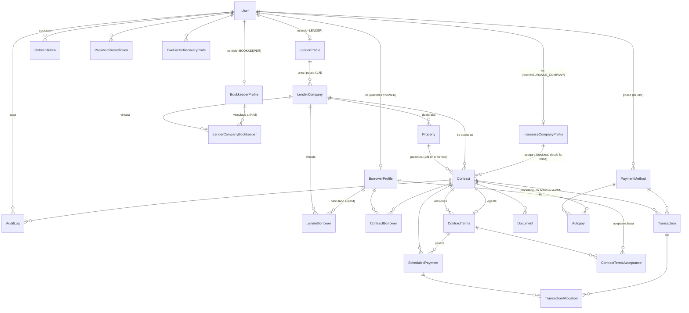

[← Índice del plan](README.md)  ·  [Anterior: 3. Arquitectura del backend](03-arquitectura-backend.md)  ·  [Siguiente: 5. Qué NO debemos copiar de Owner](05-que-no-copiar-de-owner.md)

---

# 4. Base de datos

> **Revisión 2026-09-04**: esta sección se reescribió a partir de (1) el nuevo contexto funcional entregado por Spencer y (2) el [Product Board](../PML%20—%20PayMyLoan.ai%20Product%20Board.pdf) del 3 sep 2026. También formaliza la decisión **C-1/M-1** que ya vivía suelta en [IMPLEMENTATION_PROGRESS.md](../IMPLEMENTATION_PROGRESS.md) sin haber sido integrada aquí. El detalle de cada decisión nueva (motivo, alternativas descartadas, qué documento contradice) está en la sección [0](00-contradicciones-y-decisiones.md#decisiones-2026-09-04-ronda-fase-1) bajo los IDs `D-P1-1` a `D-P1-9`; aquí solo se aplica el resultado. Este documento (sección 4 de este plan) sigue siendo **la única fuente de verdad del modelo de datos** — ver [Docs/README.md](../README.md) para cómo se relaciona con [PAYMYLOAN_DATABASE_DESIGN.md](../PAYMYLOAN_DATABASE_DESIGN.md) (lógica financiera) y el Product Board (origen de los deltas de negocio).

## 4.1 Convenciones

- **PK**: `id String @id @default(dbgenerated("uuidv7()")) @db.Uuid` en toda tabla — decisión D0-2.
- **FK**: `String @db.Uuid`.
- **Auditoría**: `createdAt DateTime @default(now())`, `updatedAt DateTime @updatedAt` en toda tabla mutable; las tablas de solo-inserción (`AuditLog`, `TransactionAllocation`, `ContractTermsAcceptance`, `WebhookEvent`) **no** llevan `updatedAt`.
- **Eliminación y desactivación** — a partir de esta revisión se distinguen explícitamente **dos conceptos que antes se solapaban** en `User.deletedAt` (decisión `D-P1-2`, motivada por el nuevo requisito de Admin de "activar/desactivar sin eliminar"):
  - **`isActive` (activación reversible)**: existe solo en `User`. Es el interruptor que el ADMIN opera sobre cualquier usuario, de cualquier rol. `isActive = false` bloquea el login; el registro y todo su historial permanecen intactos, visibles donde corresponda, y el usuario puede reactivarse. **No es una forma de borrado.**
  - **`deletedAt` (eliminación lógica)**: sigue existiendo, sin cambios de mecánica, para `User` y para toda tabla con relevancia financiera, legal o de negocio (`LenderProfile`, `LenderCompany`, `BorrowerProfile`, `BookkeeperProfile`, `InsuranceCompanyProfile`, `Contract`, `Property`, `PaymentMethod`, `Document`) — nunca `DELETE` físico (A-5). Representa un retiro que en la práctica se espera **infrecuente y más permanente** que una desactivación (p. ej. una empresa prestamista que cierra operaciones). El código actual (`softDeleteUser`) ya usa `deletedAt` para el único botón "Eliminar" que existe hoy; con `isActive` nuevo, ese botón pasa a mapear conceptualmente a "desactivar", y `deletedAt` queda reservado para cuando de verdad haga falta retirar el registro (ver impacto en sección [15](15-riesgos-y-decisiones-pendientes.md)).
  - Regla de login (aplica en Fase 2/3, no en Fase 1, se documenta aquí porque nace de un campo de esta fase): un usuario solo puede autenticarse si `deletedAt IS NULL AND isActive = true`.
- **Mapeo**: modelos PascalCase singular, `@@map` a snake_case plural.
- **Dinero**: `Decimal` con precisión fija (`@db.Decimal(14,2)` para montos, `@db.Decimal(6,3)` para tasas), nunca `Float`/`number` de JS en cálculos.

## 4.2 Diagrama de relaciones



## 4.3 Tablas

Convención por tabla: para qué existe, de qué depende, y — cuando aplica — la decisión (`D-P1-n`) que la originó o modificó respecto al plan anterior.

### `User` (extiende la tabla ya existente)

| Campo | Tipo | Obligatorio | Notas |
|---|---|---|---|
| id | Uuid | Sí | PK, uuidv7 |
| name | String | Sí | ya existe |
| email | String | Sí (único) | ya existe |
| password | String | Sí | ya existe, bcrypt |
| **role** | enum `UserRole` | Sí | `ADMIN` / `LENDER` / `BORROWER` / `BOOKKEEPER` / `INSURANCE_COMPANY` — **2 valores nuevos** respecto al plan anterior, ver `D-P1-1` |
| **isActive** | Boolean | Sí | **campo nuevo**, default `true` — ver `D-P1-2` y 4.1 |
| twoFactorSecret | String? | No | ya existe |
| isTwoFactorEnabled | Boolean | Sí | ya existe, default false |
| lastLoginAt | DateTime? | No | ya planeado — detecta cuentas nunca activadas |
| deletedAt | DateTime? | No | ya existe — ver semántica redefinida en 4.1 |
| createdAt / updatedAt | DateTime | Sí | ya existen |

- **Depende de**: nada.
- **Por qué `BOOKKEEPER`/`INSURANCE_COMPANY` sí entran al enum ahora, y `CPA`/`Title Company` no** (`D-P1-1`): el Product Board nombra 6 tipos de participante, pero solo 4 tienen una acción descrita que requiere **loguearse y operar dentro de la plataforma** con datos propios (Lender, Borrower, Bookkeeper, Insurance Company — el Bookkeeper necesita ver registros financieros del prestamista que lo contrató; la aseguradora necesita quedar asociada a un contrato). CPA y Title Company, en la redacción del Product Board, reciben **documentos/exports** (reporte de fin de año, carta de payoff) — no se describe que necesiten una cuenta propia con su propio dashboard. Forzar su alta como rol ahora obligaría a diseñar su superficie de autorización sin tener ese requisito confirmado. Quedan **fuera del enum en esta fase**, documentados como decisión pendiente en la sección [15](15-riesgos-y-decisiones-pendientes.md) con las opciones concretas evaluadas (sin cuenta / cuenta invitada de solo lectura vía link firmado / rol completo).

### `LenderProfile` (existente — se reduce de alcance)

| Campo | Tipo | Obligatorio | Notas |
|---|---|---|---|
| id | Uuid | Sí | PK |
| userId | Uuid → User | Sí (único) | 1:1 con el `User` de rol `LENDER` |
| ~~contactPhone~~ | ~~String?~~ | — | **Eliminado 2026-09-08 (`D-P4-8`)** — quedó redundante con `User.phone` (agregado después, `D-P2-4`, como teléfono de cuenta genérico para todos los roles). Era el único campo propio editable de esta tabla; migración `20260908234923_remove_lender_profile_contact_phone` |
| createdByAdminId | Uuid? → User | No | **nulo permitido** (`D-P1-10`) — nulo cuando el propio Prestamista se auto-registró; tiene valor cuando lo dio de alta un Admin (`BE-040`, que sigue existiendo en paralelo) |
| notes | Text? | No | uso interno de Admin sobre la persona |
| deletedAt | DateTime? | No | |
| createdAt / updatedAt | DateTime | Sí | |

- **Depende de**: `User`.
- **Relación**: 1:N hacia `LenderCompany` — ver `D-P1-3`.
- **Qué cambió respecto al plan anterior**: `companyName`, la dirección de negocio, `status`/`LenderStatus` y `stripeConnectedAccountId` **se mueven a `LenderCompany`** (nueva tabla, abajo). `LenderProfile` deja de ser el tenant: pasa a ser solo el envoltorio de identidad de la **persona** Prestamista, que ahora puede poseer varias empresas. El campo `status` desaparece de aquí porque el control de acceso por usuario ya lo cubre `User.isActive` (`D-P1-2`); la suspensión de una empresa puntual vive en `LenderCompany.status` (`D-P1-8`).
- **`createdByAdminId` nulo — auto-registro (`D-P1-10`)**: Spencer confirmó que `LENDER` y `BORROWER` (únicamente estos dos roles) pueden auto-registrarse vía un endpoint público, **además** de los flujos ya existentes (Admin da de alta un Lender, un Lender da de alta/vincula un Borrower) — no en reemplazo de ellos. `ADMIN`, `BOOKKEEPER` e `INSURANCE_COMPANY` nunca se auto-registran, siempre los crea otro usuario. El endpoint de auto-registro en sí (`POST /api/auth/register`) es trabajo de Fase 2 — este cambio de Fase 1 solo habilita el campo a nivel de datos.

### `LenderCompany` (NUEVA — es el tenant real)

| Campo | Tipo | Obligatorio | Notas |
|---|---|---|---|
| id | Uuid | Sí | PK |
| lenderProfileId | Uuid → LenderProfile | Sí | dueño — **no** único: un `LenderProfile` puede poseer N `LenderCompany` |
| companyName | String | Sí | razón social |
| **ein** | String | Sí (único) | Employer Identification Number, formato `XX-XXXXXXX`; validación de formato en Zod (Fase 4), unicidad a nivel de BD — ver decisión pendiente sobre el caso "misma empresa, dos socios con login propio" en sección [15](15-riesgos-y-decisiones-pendientes.md) |
| contactPhone | String? | No | |
| addressLine1 | String | Sí | dirección de negocio |
| addressLine2 | String? | No | |
| city | String | Sí | |
| state | String(2) | Sí | |
| postalCode | String | Sí | |
| **isOpenToDeals** | Boolean | Sí | default `true` — corresponde al toggle "Open to Deals / Not Taking Loans" del Product Board. Ya estaba identificado como delta `M-4` en [IMPLEMENTATION_PROGRESS.md](../IMPLEMENTATION_PROGRESS.md); esta revisión lo reubica aquí (antes estaba propuesto sobre `LenderProfile`, que ya no es el tenant) |
| status | enum `LenderCompanyStatus` | Sí | `ACTIVE` / `SUSPENDED`, default `ACTIVE` — suspensión de **esta empresa puntual** por Admin (una empresa bajo revisión no bloquea el login del usuario ni sus otras empresas) — ver `D-P1-8` |
| stripeConnectedAccountId | String? | No | reservado para cuando se cierre la decisión Connect (A-3) |
| createdByUserId | Uuid → User | Sí | quién la creó (el propio Prestamista, o un Admin en su nombre) |
| notes | Text? | No | |
| deletedAt | DateTime? | No | bloqueado por regla de servicio si tiene `Contract` en estado `ACTIVE`/`DELINQUENT` (misma regla que antes tenía BE-044 sobre `LenderProfile`, ahora aplicada a nivel de empresa) |
| createdAt / updatedAt | DateTime | Sí | |

- **Depende de**: `LenderProfile`.
- **Relación**: 1:N hacia `Property`, `Contract`, y N:M hacia `BorrowerProfile` (vía `LenderBorrower`) y `BookkeeperProfile` (vía `LenderCompanyBookkeeper`). Es el ancla real de aislamiento multi-tenant — reemplaza a `LenderProfile` en ese rol.
- **Limitación conocida, aceptada para esta fase**: una `LenderCompany` tiene un único `lenderProfileId` dueño. Si dos personas (dos `User` con rol `LENDER`) son socias de la misma empresa y ambas necesitan login propio, este modelo no lo soporta todavía (requeriría una tabla `LenderCompanyMember` N:M, análoga a `LenderBorrower`) — no se construye sin confirmar que el negocio lo necesita; queda en la sección [15](15-riesgos-y-decisiones-pendientes.md).

### `BorrowerProfile` (existente — pasa a ser a nivel de plataforma)

| Campo | Tipo | Obligatorio | Notas |
|---|---|---|---|
| id | Uuid | Sí | PK |
| userId | Uuid → User | Sí (único) | 1:1 con el `User` de rol `BORROWER` |
| phone | String? | No | |
| addressLine1 / city / state / postalCode | String? | No | dirección personal del deudor |
| createdByUserId | Uuid? → User | No | **nulo permitido** (`D-P1-10`) — nulo cuando el propio Deudor se auto-registró; tiene valor cuando lo dio de alta un Lender (`BE-045`, que sigue existiendo en paralelo). Ver también `PB-013` (Fase 2, el endpoint en sí) |
| deletedAt | DateTime? | No | bloqueado si tiene `ContractBorrower` activo en un contrato `ACTIVE`/`DELINQUENT` con **cualquier** prestamista |
| createdAt / updatedAt | DateTime | Sí | |

- **Depende de**: `User`.
- **Relación**: N:M con `LenderCompany` vía `LenderBorrower`; N:M con `Contract` vía `ContractBorrower`.
- **Qué cambió respecto al plan anterior** (`D-P1-4`, formaliza `C-1`/`M-1` de [IMPLEMENTATION_PROGRESS.md](../IMPLEMENTATION_PROGRESS.md)): se elimina el campo `lenderId NOT NULL` que ataba cada deudor a un único prestamista. Motivo funcional explícito del encargo: "un usuario BORROWER podrá tener múltiples préstamos, préstamos con diferentes lenders". El aislamiento por tenant para un deudor ya no es "pertenece a", es "está vinculado a" — se resuelve con `LenderBorrower`.
- **Campo `notes` retirado de aquí** (`D-P1-9`): en el diseño anterior existían notas internas del prestamista sobre el deudor directamente en `BorrowerProfile`. Con un deudor compartible entre varios prestamistas, esas notas dejarían de ser privadas — un Prestamista B vería las notas que el Prestamista A escribió sobre el mismo deudor. Se mueven a `LenderBorrower.notes` (abajo), que sí es privado por relación.

### `LenderBorrower` (NUEVA/formalizada — vínculo prestamista↔deudor)

| Campo | Tipo | Obligatorio | Notas |
|---|---|---|---|
| id | Uuid | Sí | PK |
| lenderCompanyId | Uuid → LenderCompany | Sí | |
| borrowerProfileId | Uuid → BorrowerProfile | Sí | |
| status | enum `TenantLinkStatus` | Sí | `ACTIVE` / `REMOVED`, default `ACTIVE` |
| notes | Text? | No | notas privadas de esta empresa sobre este deudor — ver `D-P1-9` |
| invitedByUserId | Uuid → User | Sí | quién creó el vínculo |
| createdAt | DateTime | Sí | |
| removedAt | DateTime? | No | quitar el vínculo (`DELETE /api/lenders/me/borrowers/:id`) es esto, **no** un borrado del `BorrowerProfile` — mismo principio que ya anotaba el delta `M-3` |

- **Depende de**: `LenderCompany`, `BorrowerProfile`.
- **Constraint**: `@@unique([lenderCompanyId, borrowerProfileId])`.
- **Flujo de alta** (afecta a Fase 5, se anota aquí porque nace de esta tabla): crear un deudor para una empresa ya no es siempre "crear `User` + `BorrowerProfile`" — si el email ya existe como `BORROWER` en la plataforma, solo se crea la fila `LenderBorrower`; si no existe, se crea todo en una `$transaction` como antes.

### `BookkeeperProfile` (NUEVA)

| Campo | Tipo | Obligatorio | Notas |
|---|---|---|---|
| id | Uuid | Sí | PK |
| userId | Uuid → User | Sí (único) | 1:1 con el `User` de rol `BOOKKEEPER` |
| phone | String? | No | |
| createdByUserId | Uuid → User | Sí | Admin o Lender — ver decisión pendiente abajo |
| notes | Text? | No | |
| deletedAt | DateTime? | No | |
| createdAt / updatedAt | DateTime | Sí | |

- **Depende de**: `User`.
- **Relación**: N:M con `LenderCompany` vía `LenderCompanyBookkeeper` — mismo patrón que `BorrowerProfile`/`LenderBorrower`, deliberadamente (`D-P1-6`): un despacho de contabilidad puede llevar los libros de varias empresas prestamistas pequeñas, igual que un deudor puede tener préstamos con varios prestamistas.
- **Quién puede crear un `BookkeeperProfile`**: el encargo dice "el ADMIN podrá crear usuarios con los demás roles permitidos", lo que cubriría a Bookkeeper; pero operacionalmente es más parecido a cómo el Lender invita a su propio Borrower (un bookkeeper trabaja *para* una empresa prestamista concreta, no es vetado centralmente). Se deja `createdByUserId` sin restringir a un rol específico en el modelo de datos (la restricción, si la hay, es de autorización — Fase 3/4) y se documenta como **pendiente de confirmación** en la sección [15](15-riesgos-y-decisiones-pendientes.md): ¿solo Admin, solo Lender, o ambos?
- **No tiene autoridad de decisión sobre préstamos** — esto es una regla de autorización (Fase 3: `withRole` nunca incluye `BOOKKEEPER` en los endpoints de creación/aceptación/cancelación de `Contract`/`ContractTerms`), **no** una restricción representable en el esquema de datos. Se documenta aquí para que quede explícito que esta fase no requiere ninguna tabla o campo adicional para cumplirla.

### `LenderCompanyBookkeeper` (NUEVA — vínculo prestamista↔contador)

| Campo | Tipo | Obligatorio | Notas |
|---|---|---|---|
| id | Uuid | Sí | PK |
| lenderCompanyId | Uuid → LenderCompany | Sí | |
| bookkeeperProfileId | Uuid → BookkeeperProfile | Sí | |
| status | enum `TenantLinkStatus` | Sí | `ACTIVE` / `REMOVED` (reutiliza el mismo enum que `LenderBorrower.status` — ambas tablas son estructuralmente el mismo patrón "vínculo prestamista↔persona") |
| invitedByUserId | Uuid → User | Sí | |
| createdAt | DateTime | Sí | |
| removedAt | DateTime? | No | |

- **Constraint**: `@@unique([lenderCompanyId, bookkeeperProfileId])`.

### `InsuranceCompanyProfile` (NUEVA — directorio de plataforma, no tenant-scoped)

| Campo | Tipo | Obligatorio | Notas |
|---|---|---|---|
| id | Uuid | Sí | PK |
| userId | Uuid → User | Sí (único) | 1:1 con el `User` de rol `INSURANCE_COMPANY` |
| companyName | String | Sí | |
| contactPhone | String? | No | |
| licenseNumber | String? | No | número de licencia de la aseguradora — **campo propuesto sin confirmar**, ver sección [15](15-riesgos-y-decisiones-pendientes.md) |
| createdByAdminId | Uuid → User | Sí | |
| notes | Text? | No | |
| deletedAt | DateTime? | No | |
| createdAt / updatedAt | DateTime | Sí | |

- **Depende de**: `User`.
- **Por qué no es tenant-scoped** (`D-P1-7`), a diferencia de Bookkeeper/Borrower: una aseguradora no trabaja para un solo prestamista — el Product Board la describe explícitamente participando en un flujo de marketplace ("carriers can bid on policies", "Coming Soon"). Modelarla como directorio de plataforma (visible a cualquier Lender al momento de elegir aseguradora para un contrato) es compatible con esa dirección futura sin construirla ahora.
- **Relación**: 1:N hacia `Contract` (una aseguradora puede estar asociada a muchos contratos; un contrato tiene a lo sumo una aseguradora en esta fase — ver `Contract.insuranceCompanyId`).
- **Qué queda explícitamente fuera de esta fase** (Product Board, sección "Coming Soon"): solicitud de EOI dentro de la plataforma, bidding de carriers, mortgagee clause auto-rellenado desde el perfil del Lender. Solo se modela la asociación aseguradora↔contrato — el resto necesitaría tablas propias (`EOIRequest`, `InsurancePolicy`) que no se crean en esta fase.

### `Property` (NUEVA)

Revierte la decisión `A-4` del plan anterior (dirección embebida en `Contract`) — ver `D-P1-5` para la justificación completa y el detalle de qué documentos quedaban en contradicción.

| Campo | Tipo | Obligatorio | Notas |
|---|---|---|---|
| id | Uuid | Sí | PK |
| addressLine1 | String | Sí | |
| addressLine2 | String? | No | |
| city | String | Sí | |
| state | String(2) | Sí | |
| postalCode | String | Sí | |
| county | String? | No | jurisdicción del deed of trust |
| parcelNumber | String? | No | APN |
| propertyType | enum `PropertyType` | Sí | mismo enum que ya existía (antes vivía en `Contract`, ahora vive acá) |
| bedrooms | Int? | No | |
| bathrooms | Decimal(3,1)? | No | admite medios baños (ej. `2.5`) |
| squareFootage | Int? | No | |
| lotSize | Int? | No | pies cuadrados de terreno |
| yearBuilt | Int? | No | |
| conditionScale | Int? | No | escala 0–5 (0 = lista para mudarse, 5 = rehabilitación mayor) — mismo campo que usa `Owner` (`app/api/analyze/route.ts`) para estimar costo de reparación |
| estimatedRepairCost | Decimal(14,2)? | No | costo estimado de reparaciones — campo equivalente a `repairCosts` en `Owner` |
| estimatedMarketValue | Decimal(14,2)? | No | valor de mercado "as-is" — equivalente a `baseAvmPrice` en `Owner` |
| **afterRepairValue (ARV)** | Decimal(14,2)? | No | valor estimado post-reparación — equivalente a `arv` en `Owner` |
| lastSalePrice | Decimal(14,2)? | No | |
| lastSaleDate | DateTime? | No | |
| annualPropertyTax | Decimal(14,2)? | No | equivalente a `annualTaxes` en `Owner` |
| annualInsuranceEstimate | Decimal(14,2)? | No | estimado, no la póliza real — equivalente a `insuranceAnnual` en `Owner` |
| createdByUserId | Uuid → User | Sí | |
| lenderCompanyId | Uuid → LenderCompany | Sí | tenant que dio de alta la propiedad (denormalizado, mismo patrón que `AuditLog.lenderCompanyId`) |
| deletedAt | DateTime? | No | bloqueado por regla de servicio si está referenciada por un `Contract` no `CANCELLED` |
| createdAt / updatedAt | DateTime | Sí | |

- **Depende de**: `User`, `LenderCompany`.
- **Origen de los campos de valuación/ARV/impuestos**: instrucción explícita del encargo ("puedes usar los mismos campos que usa Owner para el cálculo"). Se tomaron literalmente del endpoint `app/api/analyze/route.ts` de `Owner` (integración con la API de RentCast): `sqft`, `yearBuilt`, `propertyType`, `bedrooms`, `bathrooms`, `lotSize`, `arv`, `baseAvmPrice`, `repairCosts`, `annualTaxes`, `insuranceAnnual`, `conditionScale`, `lastSalePrice`/`lastSaleDate`. **No se copia** la maquinaria de comparables (`recentSales`/`recentRents`, cálculo automático `calculateTopTierARV`) — eso es una integración con un proveedor de datos externo (RentCast u otro), es lógica de servicio, no schema, y no está confirmada para PayMyLoan. Todos estos campos nacen **nulos y de carga manual** por el Prestamista en esta fase; automatizar su cálculo vía una API de valuation es una decisión de producto pendiente (sección [15](15-riesgos-y-decisiones-pendientes.md)).
- **Relación `Property` ↔ `Contract`** (`D-P1-5`): se eligió **1 `Property` : N `Contract` a lo largo del tiempo**, con `Contract.propertyId` como FK obligatoria simple (no tabla puente). Razonamiento:
  - Un contrato tiene exactamente una propiedad como garantía — no se pidió ni se necesita soportar *blanket loans* (una hipoteca sobre varias propiedades) en esta fase; ese caso queda igual de abierto que antes (riesgo #7 de la sección [15](15-riesgos-y-decisiones-pendientes.md)), pero **ahora es más barato de resolver después** si se confirma que hace falta: ya existe `Property` como entidad propia, agregar soporte blanket es reemplazar la FK simple por una tabla puente `ContractProperty`, sin tener que extraer `Property` de `Contract` primero (que sí hubiera sido una migración real bajo el diseño anterior).
  - Una misma propiedad **sí** puede pasar por varios contratos en el tiempo (refinanciamiento, segunda posición, un préstamo nuevo tras el payoff del anterior, o incluso con un prestamista distinto si la propiedad cambió de dueño) — no hay motivo para bloquear esto con un `@@unique`, y es el comportamiento real de `Owner.Contract.propertyId` (FK simple, sin unicidad), que se usa aquí como precedente directo.
  - `Property` no es compartida entre tenants: nace con el `lenderCompanyId` de quien la dio de alta. Si en el futuro el marketplace del Product Board requiere que una propiedad sea visible cross-tenant (deal flow), es un cambio de visibilidad, no de cardinalidad.

### `Contract` (modificada)

| Campo | Tipo | Obligatorio | Notas |
|---|---|---|---|
| id | Uuid | Sí | PK |
| **lenderCompanyId** | Uuid → LenderCompany | Sí | clave de tenant — **antes `lenderId → LenderProfile`**, ver `D-P1-3` |
| **propertyId** | Uuid → Property | Sí | **campo nuevo**, ver `D-P1-5` — reemplaza los campos de dirección embebidos |
| **insuranceCompanyId** | Uuid? → InsuranceCompanyProfile | No | **campo nuevo**, ver `D-P1-7` — nulo hasta el momento de la firma del contrato; lo asigna el Prestamista |
| contractNumber | String | Sí (único) | formato `PML-{año}-{secuencial}`, generado por el servicio |
| status | enum `ContractStatus` | Sí | default `DRAFT` — sin cambios de máquina de estados, ver [8.1](08-contratos.md#81-ciclo-de-vida-y-estados) |
| currentTermsId | Uuid → ContractTerms? | No (único) | sin cambios |
| currentPrincipalBalance | Decimal(14,2)? | No | caché derivado, sin cambios |
| nextPaymentDueDate | DateTime? | No | caché derivado, sin cambios |
| createdByUserId | Uuid → User | Sí | sin cambios |
| activatedAt / paidOffAt / cancelledAt | DateTime? | No | sin cambios |
| deletedAt | DateTime? | No | sin cambios |
| createdAt / updatedAt | DateTime | Sí | sin cambios |

- **Campos removidos respecto al plan anterior**: `addressLine1`, `addressLine2`, `city`, `state`, `postalCode`, `county`, `propertyType`, `parcelNumber` — todos migran a `Property` (`D-P1-5`).
- **Todo lo demás de la sección [8 (Contratos)](08-contratos.md) sigue aplicando sin cambios** (ciclo de vida, versionado de `ContractTerms`, aceptación bilateral D0-3) — la única diferencia es de dónde sale la dirección/valuación y a qué tenant pertenece el contrato.

### `ContractTerms`, `ContractTermsAcceptance`, `ContractBorrower`

**Sin cambios de forma** respecto al plan anterior — siguen colgando de `Contract`/`BorrowerProfile` exactamente igual. El único efecto indirecto: la regla de servicio de `ContractBorrower` ("`borrowerProfile` y `contract` deben pertenecer al mismo tenant") ahora se verifica como `EXISTS(LenderBorrower WHERE lenderCompanyId = contract.lenderCompanyId AND borrowerProfileId = ... AND status = 'ACTIVE')`, en vez de comparar un `lenderId` directo en `BorrowerProfile` (que ya no existe) — es un cambio de regla de servicio (Fase 6), no de estas tres tablas.

### `ScheduledPayment`, `TransactionAllocation`, `WebhookEvent`, `RefreshToken`, `PasswordResetToken`, `TwoFactorRecoveryCode`, `Document`

**Sin cambios** respecto al plan anterior. Siguen colgando de `Contract`/`Transaction`/`User` exactamente igual; ninguno referencia `lenderId`/`LenderProfile` directamente.

### `Transaction` (modificada)

Sin cambios de campos. Único cambio: **se repone `TransactionType.PAYOFF_PAYMENT`** en el enum (ver 4.4) — delta `M-5`, ya identificado en [IMPLEMENTATION_PROGRESS.md](../IMPLEMENTATION_PROGRESS.md), esta revisión lo formaliza como parte del backlog de Fase 1 en vez de dejarlo como nota suelta.

### `PaymentMethod` (sin cambios de forma) + `Autopay` (NUEVA, sin activar)

`PaymentMethod` no cambia de campos. Se agrega la tabla `Autopay` (delta `M-6`, ya identificado en [IMPLEMENTATION_PROGRESS.md](../IMPLEMENTATION_PROGRESS.md); esta revisión la formaliza en el backlog) — se **modela pero no se activa** (A-2 sigue vigente: el alcance no confirma cobro recurrente obligatorio para el MVP):

| Campo | Tipo | Obligatorio | Notas |
|---|---|---|---|
| id | Uuid | Sí | PK |
| contractId | Uuid → Contract | Sí | |
| borrowerProfileId | Uuid → BorrowerProfile | Sí | |
| paymentMethodId | Uuid → PaymentMethod | Sí | |
| status | enum `AutopayStatus` | Sí | `ACTIVE` / `PAUSED` / `CANCELLED` |
| amountType | enum `AutopayAmountType` | Sí | `SCHEDULED_AMOUNT_DUE` / `FIXED_AMOUNT` |
| fixedAmount | Decimal(14,2)? | No | solo si `amountType = FIXED_AMOUNT` |
| nextAttemptScheduledFor | DateTime? | No | |
| cancelledByUserId | Uuid? → User | No | |
| cancelledAt | DateTime? | No | |
| createdAt / updatedAt | DateTime | Sí | |

- **Constraint**: `@@unique([contractId, borrowerProfileId])`.
- Ningún servicio ni endpoint la usa todavía — solo existe la tabla, para no requerir una migración estructural cuando se confirme si el MVP la necesita.

### `AuditLog` (modificada)

| Campo | Tipo | Obligatorio | Notas |
|---|---|---|---|
| id | Uuid | Sí | PK |
| actorUserId | Uuid? → User | No | |
| isSystemActor | Boolean | Sí | default false |
| systemActorLabel | String? | No | |
| action | String | Sí | sigue sin ser enum de Postgres — ver justificación original |
| entityType | String | Sí | |
| entityId | String? | No | |
| **lenderCompanyId** | Uuid? → LenderCompany | No | **antes `lenderId → LenderProfile`** — ver `D-P1-3` |
| **contractId** | Uuid? → Contract | No | **campo agregado en implementación**: el ERD de esta sección ya mostraba `Contract ||--o{ AuditLog`, pero esta tabla de campos nunca lo había listado — inconsistencia heredada del plan original (antes de la revisión 2026-09-04), cerrada al implementar BE-020 |
| metadata | Json? | No | |
| ipAddress / userAgent | String? / Text? | No | |
| createdAt | DateTime | Sí | sin `updatedAt` |

- **Eventos nuevos a auditar** (se agregan a la lista original): `USER_ACTIVATED`, `USER_DEACTIVATED`, `LENDER_COMPANY_CREATED`, `LENDER_COMPANY_UPDATED`, `LENDER_COMPANY_SUSPENDED`, `PROPERTY_CREATED`, `PROPERTY_UPDATED`, `BORROWER_LINKED_TO_LENDER`, `BORROWER_UNLINKED_FROM_LENDER`, `BOOKKEEPER_CREATED`, `BOOKKEEPER_LINKED_TO_LENDER`, `BOOKKEEPER_UNLINKED_FROM_LENDER`, `INSURANCE_COMPANY_CREATED`, `INSURANCE_COMPANY_LINKED_TO_CONTRACT`.

## 4.4 Enums

```
enum UserRole { ADMIN LENDER BORROWER BOOKKEEPER INSURANCE_COMPANY }
enum LenderCompanyStatus { ACTIVE SUSPENDED }
enum TenantLinkStatus { ACTIVE REMOVED }
enum ContractStatus { DRAFT PENDING_ACCEPTANCE ACTIVE DELINQUENT PAID_OFF CANCELLED }
enum ContractTermsStatus { DRAFT PENDING_ACCEPTANCE ACCEPTED REJECTED SUPERSEDED }
enum AcceptanceDecision { ACCEPTED REJECTED }
enum LoanStructure { INTEREST_ONLY AMORTIZED BALLOON }
enum DayCountConvention { THIRTY_360 ACTUAL_365 }
enum LateFeeType { FLAT PERCENTAGE }
enum PropertyType { SINGLE_FAMILY MULTI_FAMILY CONDO TOWNHOUSE LAND COMMERCIAL OTHER }
enum ScheduledPaymentStatus { PENDING PARTIALLY_PAID PAID VOIDED }
enum TransactionType { SCHEDULED_PAYMENT PRINCIPAL_PREPAYMENT PAYOFF_PAYMENT LATE_FEE_PAYMENT REFUND ADJUSTMENT }
enum TransactionStatus { PENDING PROCESSING SUCCEEDED FAILED RETURNED REFUNDED CANCELLED }
enum PaymentMethodChannel { ACH WIRE CHECK CARD MANUAL }
enum AllocationType { LATE_FEE INTEREST PRINCIPAL }
enum PaymentMethodStatus { ACTIVE REMOVED }
enum PaymentMethodVerificationStatus { PENDING_VERIFICATION VERIFIED FAILED }
enum AutopayStatus { ACTIVE PAUSED CANCELLED }
enum AutopayAmountType { SCHEDULED_AMOUNT_DUE FIXED_AMOUNT }
enum WebhookProvider { STRIPE }
enum WebhookEventStatus { RECEIVED PROCESSED FAILED IGNORED }
enum DocumentType { PROMISSORY_NOTE DEED_OF_TRUST SETTLEMENT_STATEMENT STATEMENT OTHER }
enum DocumentVisibility { SHARED LENDER_ONLY BORROWER_ONLY ADMIN_ONLY }
enum DocumentStatus { ACTIVE ARCHIVED DELETED }
```

**Cambios respecto al plan anterior**: `UserRole` gana `BOOKKEEPER`/`INSURANCE_COMPANY`; `LenderStatus` se elimina y se reemplaza por `LenderCompanyStatus` (mismos valores, distinto dueño); `TenantLinkStatus` es nuevo (compartido por `LenderBorrower` y `LenderCompanyBookkeeper`); `TransactionType` recupera `PAYOFF_PAYMENT`; `AutopayStatus`/`AutopayAmountType` son nuevos (M-6); `PropertyType` no cambia de valores, cambia de tabla dueña.

## 4.5 Índices y constraints principales

| Tabla | Unique | Índices adicionales | onDelete relevante |
|---|---|---|---|
| `lender_profiles` | `userId` | — | — |
| `lender_companies` | `ein` | `[lenderProfileId]`, `[status]` | lenderProfileId: Restrict |
| `borrower_profiles` | `userId` | — | — |
| `lender_borrowers` | `[lenderCompanyId, borrowerProfileId]` | `[borrowerProfileId]` | lenderCompanyId: Cascade; borrowerProfileId: Restrict |
| `bookkeeper_profiles` | `userId` | — | — |
| `lender_company_bookkeepers` | `[lenderCompanyId, bookkeeperProfileId]` | `[bookkeeperProfileId]` | lenderCompanyId: Cascade; bookkeeperProfileId: Restrict |
| `insurance_company_profiles` | `userId` | — | — |
| `properties` | — | `[lenderCompanyId]`, `[createdByUserId]` | lenderCompanyId: Restrict |
| `contracts` | `contractNumber`, `currentTermsId` | `[lenderCompanyId, status]`, `[lenderCompanyId, createdAt]`, `[propertyId]`, `[insuranceCompanyId]` | lenderCompanyId: Restrict; propertyId: Restrict; insuranceCompanyId: SetNull |
| `contract_terms` | `[contractId, versionNumber]`, `supersedesId` | `[contractId, status]` | contractId: Cascade |
| `contract_terms_acceptances` | `[contractTermsId, borrowerProfileId]` | `[borrowerProfileId]` | contractTermsId: Cascade |
| `contract_borrowers` | PK compuesta `[contractId, borrowerProfileId]` | `[borrowerProfileId]` | contractId: Cascade |
| `scheduled_payments` | `[contractTermsId, sequenceNumber]` | `[contractId, dueDate]`, `[contractId, status]` | contractId: Cascade |
| `transactions` | `stripePaymentIntentId` | `[contractId, status]`, `[contractId, createdAt]` | contractId: Restrict |
| `transaction_allocations` | — | `[transactionId]`, `[scheduledPaymentId]` | transactionId: Cascade |
| `payment_methods` | `stripePaymentMethodId` | `[userId]` | — |
| `autopays` | `[contractId, borrowerProfileId]` | `[status, nextAttemptScheduledFor]` | contractId: Cascade |
| `webhook_events` | `externalEventId` | `[status]` | — |
| `audit_logs` | — | `[lenderCompanyId, createdAt]`, `[actorUserId, createdAt]`, `[entityType, entityId]`, `[contractId, createdAt]` | lenderCompanyId: SetNull; contractId: SetNull |
| `refresh_tokens` | `tokenHash` | `[userId]` | userId: Cascade |
| `password_reset_tokens` | `tokenHash` | `[userId]` | userId: Cascade |

## 4.6 Reglas de negocio a nivel de datos

1. `Contract.lenderCompanyId` y `Contract.propertyId` nunca se editan una vez creados — mover un contrato de tenant o de propiedad no es una operación soportada.
2. `LenderBorrower`/`LenderCompanyBookkeeper` son la única forma de vincular/desvincular; nunca se borra físicamente una fila — se marca `status = REMOVED` con `removedAt`.
3. `ContractTerms` con `status=ACCEPTED` nunca se actualiza — cualquier cambio crea una nueva versión.
4. `Contract.status` pasa a `ACTIVE` solo cuando la `ContractTerms` vigente tiene una `ContractTermsAcceptance.decision=ACCEPTED` de **todos** los `ContractBorrower` activos.
5. Ningún `ScheduledPayment` nace `PAID`.
6. Prelación de aplicación de una `Transaction`: mora → interés → capital.
7. `Transaction.status` nunca nace `SUCCEEDED`.
8. `Contract.currentPrincipalBalance` se recalcula únicamente dentro de la misma transacción de base de datos que crea las `TransactionAllocation` correspondientes.
9. `AuditLog` es de solo inserción.
10. Un usuario con `isActive = false` o `deletedAt IS NOT NULL` no puede autenticarse, sin importar su rol — ver 4.1.
11. `LenderCompany.ein` es único a nivel de plataforma — dos empresas prestamistas no pueden compartir el mismo EIN mientras no se confirme el caso de "múltiples socios, mismo EIN" (sección [15](15-riesgos-y-decisiones-pendientes.md)).
12. `Contract.insuranceCompanyId` solo se puede asignar por el Prestamista dueño del contrato, y únicamente sobre un `InsuranceCompanyProfile` sin `deletedAt`.
13. `Property.deletedAt` está bloqueado por regla de servicio si existe algún `Contract` no `CANCELLED` que la referencie.
14. `BOOKKEEPER` nunca aparece como rol permitido en ningún endpoint de creación, propuesta, aceptación, rechazo o cancelación de `Contract`/`ContractTerms` — regla de autorización (Fase 3), no de esquema.

---

[← Índice del plan](README.md)  ·  [Anterior: 3. Arquitectura del backend](03-arquitectura-backend.md)  ·  [Siguiente: 5. Qué NO debemos copiar de Owner](05-que-no-copiar-de-owner.md)
