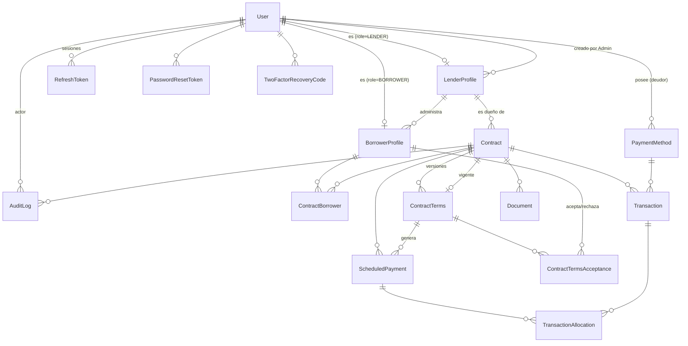

[← Índice del plan](README.md)  ·  [Anterior: 3. Arquitectura del backend](03-arquitectura-backend.md)  ·  [Siguiente: 5. Qué NO debemos copiar de Owner](05-que-no-copiar-de-owner.md)

---

# 4. Base de datos

## 4.1 Convenciones

- **PK**: `id String @id @default(dbgenerated("uuidv7()")) @db.Uuid` en toda tabla — decisión D0-2. Requiere Postgres **18** (`uuidv7()` es función nativa desde esa versión; Postgres 16, la versión actual del `docker-compose.yml`, no la tiene).
- **FK**: `String @db.Uuid`, tipadas para que Postgres pueda usar índices B-tree nativos sobre UUID sin cast.
- **Auditoría**: `createdAt DateTime @default(now())`, `updatedAt DateTime @updatedAt` en toda tabla mutable; las tablas de solo-inserción (`AuditLog`, `TransactionAllocation`, `ContractTermsAcceptance`, `WebhookEvent`) **no** llevan `updatedAt`.
- **Eliminación**: siempre lógica (`deletedAt DateTime?` o campo `status`) para `User`, `LenderProfile`, `BorrowerProfile`, `Contract`, `PaymentMethod`, `Document` — ver A-5.
- **Mapeo**: modelos PascalCase singular, `@@map` a snake_case plural — mismo patrón ya usado por `User → users`.
- **Dinero**: `Decimal` con precisión fija (`@db.Decimal(14,2)` para montos, `@db.Decimal(6,3)` para tasas), nunca `Float`/`number` de JS en cálculos — el motivo (redondeo acumulado en amortizaciones largas) ya lo documentó [PAYMYLOAN_DATABASE_DESIGN.md](../PAYMYLOAN_DATABASE_DESIGN.md) sección 18 y sigue aplicando.

## 4.2 Diagrama de relaciones



## 4.3 Tablas

Para cada tabla: para qué existe, de qué depende, qué información viene conceptualmente de Owner y qué es nueva.

### `User` (extiende la tabla ya existente)

| Campo | Tipo | Obligatorio | Notas |
|---|---|---|---|
| id | Uuid | Sí | PK, uuidv7 |
| name | String | Sí | ya existe |
| email | String | Sí (único) | ya existe |
| password | String | Sí | ya existe, bcrypt |
| **role** | enum `UserRole` | Sí | **campo nuevo** — `ADMIN`/`LENDER`/`BORROWER`, default no aplica (se fuerza explícito en cada alta) |
| twoFactorSecret | String? | No | ya existe |
| isTwoFactorEnabled | Boolean | Sí | ya existe, default false |
| lastLoginAt | DateTime? | No | **campo nuevo** — para detectar cuentas nunca activadas |
| deletedAt | DateTime? | No | ya existe |
| createdAt / updatedAt | DateTime | Sí | ya existen |

- **Depende de**: nada (raíz de identidad).
- **Origen**: la forma base ya existe en `paymyloan-back`. `role` es la única adición de forma — **deliberadamente distinto** de [PAYMYLOAN_DATABASE_DESIGN.md](../PAYMYLOAN_DATABASE_DESIGN.md) (que prohibía `role` en `User`, D1 de ese documento): esa prohibición existía porque en el modelo simétrico el rol era relativo al préstamo; aquí, por decisión D0-1, el rol es un atributo fijo de la persona, así que ponerlo en `User` no reintroduce el problema que ese documento señalaba en Owner (que Owner mezclaba `role` global con lógica de negocio ambigua vía perfiles múltiples opcionales) — aquí `role` es exhaustivo, exclusivo y determina un único perfil posible.

### `LenderProfile`

| Campo | Tipo | Obligatorio | Notas |
|---|---|---|---|
| id | Uuid | Sí | PK |
| userId | Uuid → User | Sí (único) | 1:1 con el `User` de rol `LENDER` |
| companyName | String | Sí | nombre del prestamista/inmobiliaria |
| contactPhone | String? | No | |
| addressLine1 / city / state / postalCode | String? | No | dirección de negocio del prestamista (no confundir con la dirección de garantía de un contrato) |
| status | enum `LenderStatus` | Sí | default `ACTIVE` — controla si puede iniciar sesión |
| stripeConnectedAccountId | String? | No | reservado para cuando se cierre la decisión Connect (A-3) |
| createdByAdminId | Uuid → User | Sí | qué Admin lo dio de alta |
| notes | Text? | No | uso interno de Admin |
| deletedAt | DateTime? | No | |
| createdAt / updatedAt | DateTime | Sí | |

- **Depende de**: `User` (debe existir primero, o se crea atómicamente junto con él).
- **Relación**: 1:N hacia `BorrowerProfile` y `Contract` — es el ancla del tenant.
- **Origen Owner**: patrón de perfil 1:1 tomado de `SellerProfile`/`AgentProfile`, pero exclusivo (Owner permite que la misma persona tenga varios perfiles a la vez; aquí `role` en `User` ya lo impide estructuralmente).
- **Nuevo**: el concepto de tenant administrado por un Admin no existe en Owner en absoluto.

### `BorrowerProfile`

| Campo | Tipo | Obligatorio | Notas |
|---|---|---|---|
| id | Uuid | Sí | PK |
| userId | Uuid → User | Sí (único) | 1:1 con el `User` de rol `BORROWER` |
| **lenderId** | Uuid → LenderProfile | Sí | **clave de tenant** — todo aislamiento multi-lender pasa por este campo |
| phone | String? | No | |
| addressLine1 / city / state / postalCode | String? | No | dirección personal del deudor |
| notes | Text? | No | uso interno del prestamista |
| deletedAt | DateTime? | No | bloqueado si tiene contratos no `CANCELLED`/`PAID_OFF` — regla de servicio |
| createdAt / updatedAt | DateTime | Sí | |

- **Depende de**: `User`, `LenderProfile`.
- **Relación**: N:1 con `LenderProfile`; N:M con `Contract` vía `ContractBorrower`.
- **Nuevo**: Owner no tiene equivalente — sus `BuyerProfile`/`RenterProfile` no cuelgan de un tenant.

### `Contract`

| Campo | Tipo | Obligatorio | Notas |
|---|---|---|---|
| id | Uuid | Sí | PK |
| **lenderId** | Uuid → LenderProfile | Sí | clave de tenant |
| contractNumber | String | Sí (único) | identificador humano, ej. `PML-2026-000123`, generado por el servicio (no editable) |
| status | enum `ContractStatus` | Sí | default `DRAFT` — ver máquina de estados [8.1](08-contratos.md#81-ciclo-de-vida-y-estados) |
| addressLine1 | String | Sí | dirección de la propiedad — **vive aquí por instrucción explícita (A-4), no en una tabla `Property`** |
| addressLine2 | String? | No | |
| city | String | Sí | |
| state | String(2) | Sí | |
| postalCode | String | Sí | |
| county | String? | No | relevante para jurisdicción del deed of trust |
| propertyType | enum `PropertyType` | Sí | |
| parcelNumber | String? | No | APN, cuando aplica |
| currentTermsId | Uuid → ContractTerms? | No (único) | versión vigente |
| currentPrincipalBalance | Decimal(14,2)? | No | caché derivado — nunca se edita fuera de `applyTransaction()` |
| nextPaymentDueDate | DateTime? | No | caché derivado |
| createdByUserId | Uuid → User | Sí | el usuario Prestamista que lo creó |
| activatedAt / paidOffAt / cancelledAt | DateTime? | No | hitos de ciclo de vida |
| deletedAt | DateTime? | No | solo aplica a `DRAFT` cancelados antes de tener actividad |
| createdAt / updatedAt | DateTime | Sí | |

- **Depende de**: `LenderProfile`, `User` (creador).
- **Relación**: 1:N con `ContractTerms`, `ScheduledPayment`, `Transaction`, `Document`; N:M con `BorrowerProfile` vía `ContractBorrower`.
- **Origen Owner**: reemplaza a `Contract` de Owner (`propertyId` FK + campos financieros mutables in-place, sin versionado). Se conserva el nombre `Contract` (no `Loan`) porque es el término que usa tanto Owner como el encargo de este plan.
- **Nuevo respecto a Owner**: separación identidad/términos (ver `ContractTerms`), dirección embebida en vez de FK a una tabla de inventario, `lenderId` de tenant.

### `ContractTerms`

| Campo | Tipo | Obligatorio | Notas |
|---|---|---|---|
| id | Uuid | Sí | PK |
| contractId | Uuid → Contract | Sí | |
| versionNumber | Int | Sí | secuencial por contrato |
| structure | enum `LoanStructure` | Sí | `INTEREST_ONLY` / `AMORTIZED` / `BALLOON` |
| principalAmount | Decimal(14,2) | Sí | |
| interestRate | Decimal(6,3) | Sí | tasa anual |
| dayCountConvention | enum `DayCountConvention` | Sí | default `THIRTY_360` |
| amortizationTermMonths | Int | Sí | plazo usado para el cálculo de PMT (relevante en balloon) |
| firstPaymentDate | DateTime | Sí | |
| paymentDueDay | Int | Sí | 1–31 |
| maturityDate | DateTime | Sí | fecha real de vencimiento |
| lateFeeType | enum `LateFeeType` | Sí | `FLAT` / `PERCENTAGE` |
| lateFeeAmount | Decimal(14,2) | Sí | |
| gracePeriodDays | Int | Sí | default 10 |
| calculatedMonthlyPayment | Decimal(14,2)? | No | cacheado al generar el calendario |
| status | enum `ContractTermsStatus` | Sí | default `DRAFT` — ver [8.1](08-contratos.md#81-ciclo-de-vida-y-estados) |
| createdByUserId | Uuid → User | Sí | el Prestamista que la propuso |
| changeSummary | Text? | No | motivo del cambio, obligatorio en la práctica desde v2 |
| supersedesId | Uuid → ContractTerms? | No (único) | encadena versiones |
| createdAt / updatedAt | DateTime | Sí | |

- **Depende de**: `Contract`.
- **Relación**: 1:N con `ContractTermsAcceptance`, 1:N con `ScheduledPayment` (las filas generadas por esta versión).
- **Origen Owner**: reemplaza los campos financieros de `Contract` de Owner (`totalAmount`, `principalAmount`, `interestRate`, `termInYears` — todos editables in place, sin historial). El versionado es **nuevo**, no existe nada parecido en Owner.
- **Regla dura**: una fila con `status=ACCEPTED` nunca se actualiza; cualquier cambio crea `versionNumber + 1` con `supersedesId` apuntando a la anterior — decisión D0-3.

### `ContractTermsAcceptance`

| Campo | Tipo | Obligatorio | Notas |
|---|---|---|---|
| id | Uuid | Sí | PK |
| contractTermsId | Uuid → ContractTerms | Sí | |
| borrowerProfileId | Uuid → BorrowerProfile | Sí | quién decide — nunca el Prestamista (su consentimiento es implícito al crear/proponer la versión, y queda auditado igual) |
| decision | enum `AcceptanceDecision` | Sí | `ACCEPTED` / `REJECTED` |
| decidedAt | DateTime | Sí | |
| ipAddress | String? | No | |
| userAgent | Text? | No | |
| comment | Text? | No | motivo de rechazo |
| createdAt | DateTime | Sí | **inmutable, nunca se actualiza** |

- **Depende de**: `ContractTerms`, `BorrowerProfile`.
- **Constraint**: `@@unique([contractTermsId, borrowerProfileId])`.
- **Origen**: adapta `LoanTermsAcceptance` de [PAYMYLOAN_DATABASE_DESIGN.md](../PAYMYLOAN_DATABASE_DESIGN.md) (misma justificación de por qué es tabla propia y no un campo en `ContractBorrower`: permite N deudores con voto propio y conserva el historial completo de "aceptó v1, rechazó v2, aceptó v3"). Es la pieza central de la decisión D0-3.
- **Regla de activación**: `Contract` pasa a `ACTIVE` solo cuando **todos** los `ContractBorrower` no removidos tienen una fila `ACCEPTED` para la `ContractTerms` vigente. Si cualquiera `REJECTED`, la versión pasa a `REJECTED` y el Prestamista debe proponer una nueva o cancelar el contrato.

### `ContractBorrower`

| Campo | Tipo | Obligatorio | Notas |
|---|---|---|---|
| contractId | Uuid → Contract | Sí | parte de PK compuesta |
| borrowerProfileId | Uuid → BorrowerProfile | Sí | parte de PK compuesta |
| isPrimary | Boolean | Sí | default true |
| addedByUserId | Uuid → User | Sí | |
| addedAt | DateTime | Sí | default now() |
| removedAt | DateTime? | No | soporta retirar un co-deudor sin perder el historial |

- **Depende de**: `Contract`, `BorrowerProfile` (ambos deben pertenecer al mismo `lenderId` — validado en servicio, no representable como constraint de Postgres sin trigger).
- **PK compuesta**: `@@id([contractId, borrowerProfileId])`.
- **Por qué existe**: soporta co-deudores sin forzar un `borrowerId` único en `Contract` — mismo razonamiento de costo marginal cero que ya usó `LoanProperty` en [PAYMYLOAN_DATABASE_DESIGN.md](../PAYMYLOAN_DATABASE_DESIGN.md) para N:M.

### `ScheduledPayment`

| Campo | Tipo | Obligatorio | Notas |
|---|---|---|---|
| id | Uuid | Sí | PK |
| contractId | Uuid → Contract | Sí | |
| contractTermsId | Uuid → ContractTerms | Sí | versión que generó esta fila |
| sequenceNumber | Int | Sí | único junto con `contractTermsId` |
| dueDate | DateTime | Sí | |
| principalDue / interestDue / totalDue | Decimal(14,2) | Sí | |
| projectedRemainingBalance | Decimal(14,2) | Sí | |
| amountPaid | Decimal(14,2) | Sí | default 0 |
| status | enum `ScheduledPaymentStatus` | Sí | default `PENDING` — **nunca nace `PAID`**, se elimina explícitamente el auto-marcado de Owner |
| paidInFullAt | DateTime? | No | |
| lateFeeAssessed | Decimal(14,2) | Sí | default 0 |
| lateFeeAssessedAt | DateTime? | No | |
| createdAt / updatedAt | DateTime | Sí | |

- **Depende de**: `Contract`, `ContractTerms` (solo se genera cuando la versión pasa a `ACCEPTED`).
- **Origen Owner**: corrige la mezcla calendario+transacción de `Payment` de Owner — idéntico razonamiento al ya documentado en [PAYMYLOAN_DATABASE_DESIGN.md](../PAYMYLOAN_DATABASE_DESIGN.md) sección 5.6.

### `Transaction`

| Campo | Tipo | Obligatorio | Notas |
|---|---|---|---|
| id | Uuid | Sí | PK |
| contractId | Uuid → Contract | Sí | |
| type | enum `TransactionType` | Sí | `SCHEDULED_PAYMENT` / `PRINCIPAL_PREPAYMENT` / `LATE_FEE_PAYMENT` / `REFUND` / `ADJUSTMENT` |
| status | enum `TransactionStatus` | Sí | default `PENDING`, ciclo completo — ver [9.2](09-pagos.md#92-estados-y-ciclo-ach) |
| method | enum `PaymentMethodChannel` | Sí | default `ACH` |
| amount | Decimal(14,2) | Sí | |
| currency | String(3) | Sí | default `USD` |
| stripePaymentIntentId | String? | No (único) | |
| stripeChargeId / stripePaymentMethodId | String? | No | |
| last4 | String? | No | |
| failureReason / returnCode | Text? / String? | No | |
| initiatedByUserId | Uuid? → User | No | nulo si el origen es sistema/webhook |
| initiatedAt / processedAt / settledAt / failedAt / returnedAt / refundedAt | DateTime? | variable | hitos ACH |
| notes | Text? | No | referencia manual (wire/cheque) |
| createdAt / updatedAt | DateTime | Sí | |

- **Depende de**: `Contract`.
- **Origen**: idéntico razonamiento a [PAYMYLOAN_DATABASE_DESIGN.md](../PAYMYLOAN_DATABASE_DESIGN.md) sección 5.7 — se elimina `TransactionType.PAYOFF_PAYMENT` y toda la lógica de `PayoffRequest` porque el encargo de este plan no la pide (no aparece en el alcance de vistas ni en la sección de roles); si se confirma que hace falta, se puede agregar sin romper el resto del schema.

### `TransactionAllocation`

| Campo | Tipo | Obligatorio | Notas |
|---|---|---|---|
| id | Uuid | Sí | PK |
| transactionId | Uuid → Transaction | Sí | |
| scheduledPaymentId | Uuid? → ScheduledPayment | No | nulo para abonos a capital no ligados a una fila |
| allocationType | enum `AllocationType` | Sí | `LATE_FEE` / `INTEREST` / `PRINCIPAL` |
| amount | Decimal(14,2) | Sí | |
| createdAt | DateTime | Sí | inmutable |

- **Origen**: idéntico a [PAYMYLOAN_DATABASE_DESIGN.md](../PAYMYLOAN_DATABASE_DESIGN.md) sección 5.8, misma justificación (una transacción puede cubrir mora+interés+capital de una o varias filas).

### `PaymentMethod`

| Campo | Tipo | Obligatorio | Notas |
|---|---|---|---|
| id | Uuid | Sí | PK |
| userId | Uuid → User | Sí | el Deudor dueño del método |
| status | enum `PaymentMethodStatus` | Sí | default `ACTIVE` |
| stripeCustomerId | String | Sí | |
| stripePaymentMethodId | String | Sí (único) | |
| bankName | String? | No | |
| last4 | String | Sí | |
| verificationStatus | enum `PaymentMethodVerificationStatus` | Sí | default `PENDING_VERIFICATION` |
| isDefault | Boolean | Sí | default false |
| removedAt | DateTime? | No | |
| createdAt / updatedAt | DateTime | Sí | |

- **Nota**: sin `Autopay` — ver A-2. Se conserva porque un pago puntual por ACH todavía necesita un método guardado (`SetupIntent` de Stripe).

### `WebhookEvent`

| Campo | Tipo | Obligatorio | Notas |
|---|---|---|---|
| id | Uuid | Sí | PK |
| provider | enum `WebhookProvider` | Sí | default `STRIPE` |
| externalEventId | String | Sí (único) | gate de idempotencia — ver [9.3](09-pagos.md#93-aplicación-de-pagos-prelación--waterfall) |
| eventType | String | Sí | |
| payload | Json | Sí | |
| status | enum `WebhookEventStatus` | Sí | default `RECEIVED` |
| error | Text? | No | |
| receivedAt / processedAt | DateTime | variable | |

- **Origen**: idéntico a [PAYMYLOAN_DATABASE_DESIGN.md](../PAYMYLOAN_DATABASE_DESIGN.md) sección 15/D9 — mecanismo de idempotencia sin el cual el mismo evento de Stripe reprocesado duplicaría una `Transaction`.

### `AuditLog`

| Campo | Tipo | Obligatorio | Notas |
|---|---|---|---|
| id | Uuid | Sí | PK |
| actorUserId | Uuid? → User | No | nulo si el actor es del sistema |
| isSystemActor | Boolean | Sí | default false |
| systemActorLabel | String? | No | ej. `stripe_webhook`, `late_fee_job` |
| action | String | Sí | union type de TS controla los valores permitidos, no un enum de Postgres — mismo balance que ya justificó [PAYMYLOAN_DATABASE_DESIGN.md](../PAYMYLOAN_DATABASE_DESIGN.md) sección 5.12 |
| entityType | String | Sí | |
| entityId | String? | No | |
| **lenderId** | Uuid? → LenderProfile | No | denormalizado — casi todo evento se filtra por tenant al auditar |
| metadata | Json? | No | reemplaza el `details` de texto libre de Owner |
| ipAddress | String? | No | |
| userAgent | Text? | No | |
| createdAt | DateTime | Sí | **sin `updatedAt`**, nunca se edita ni se borra |

- **onDelete**: `lenderId` con `SetNull` — el log sobrevive aunque el tenant se elimine.
- **Eventos mínimos a auditar** (lista de partida, se amplía en implementación): `USER_LOGIN_SUCCESS`, `USER_LOGIN_FAILED`, `USER_2FA_ENABLED`, `USER_2FA_DISABLED`, `USER_PASSWORD_CHANGED`, `LENDER_CREATED`, `LENDER_UPDATED`, `LENDER_DEACTIVATED`, `BORROWER_CREATED`, `BORROWER_UPDATED`, `BORROWER_DELETED`, `CONTRACT_CREATED`, `CONTRACT_TERMS_PROPOSED`, `CONTRACT_TERMS_ACCEPTED`, `CONTRACT_TERMS_REJECTED`, `CONTRACT_ACTIVATED`, `CONTRACT_CANCELLED`, `TRANSACTION_CREATED`, `TRANSACTION_SUCCEEDED`, `TRANSACTION_RETURNED`, `PAYMENT_METHOD_ADDED`, `PAYMENT_METHOD_REMOVED`.

### `PasswordResetToken`, `RefreshToken`, `TwoFactorRecoveryCode`

Tablas de soporte de autenticación — detalladas en sección [7](07-autenticacion-y-autorizacion.md), campos:

| Tabla | Campos clave | Notas |
|---|---|---|
| `PasswordResetToken` | id, userId, tokenHash(único), expiresAt, usedAt?, createdAt | token de un solo uso, patrón `VerificationToken` de Owner adaptado |
| `RefreshToken` | id, userId, tokenHash(único), expiresAt, revokedAt?, replacedByTokenId?, userAgent?, ipAddress?, createdAt | permite "logout everywhere" e invalidación ante incidente |
| `TwoFactorRecoveryCode` | id, userId, codeHash, usedAt?, createdAt | 8–10 códigos generados al activar 2FA, uso único |

### `Document` (módulo opcional / fase 2)

No pedido explícitamente por la lista de vistas del encargo, pero sí por el alcance (§4.6) y coherente con "ver contrato individual". Se diseña ahora para no bloquear el schema después, pero se ubica **al final del backlog** (sección [13](13-backlog.md), fase opcional) — no es parte del roadmap mínimo.

| Campo | Tipo | Obligatorio | Notas |
|---|---|---|---|
| id | Uuid | Sí | PK |
| contractId | Uuid → Contract | Sí | |
| type | enum `DocumentType` | Sí | `PROMISSORY_NOTE`/`DEED_OF_TRUST`/`SETTLEMENT_STATEMENT`/`STATEMENT`/`OTHER` |
| visibility | enum `DocumentVisibility` | Sí | default `SHARED` |
| status | enum `DocumentStatus` | Sí | `ACTIVE`/`ARCHIVED`/`DELETED` |
| s3Bucket / s3Key | String | Sí | único junto — nunca se sirve URL pública, corrige a Owner |
| originalFileName / mimeType / fileSizeBytes | String/String/Int | Sí | |
| uploadedByUserId | Uuid → User | Sí | |
| deletedAt | DateTime? | No | |
| createdAt / updatedAt | DateTime | Sí | |

## 4.4 Enums

```
enum UserRole { ADMIN LENDER BORROWER }
enum LenderStatus { ACTIVE SUSPENDED }
enum ContractStatus { DRAFT PENDING_ACCEPTANCE ACTIVE DELINQUENT PAID_OFF CANCELLED }
enum ContractTermsStatus { DRAFT PENDING_ACCEPTANCE ACCEPTED REJECTED SUPERSEDED }
enum AcceptanceDecision { ACCEPTED REJECTED }
enum LoanStructure { INTEREST_ONLY AMORTIZED BALLOON }
enum DayCountConvention { THIRTY_360 ACTUAL_365 }
enum LateFeeType { FLAT PERCENTAGE }
enum PropertyType { SINGLE_FAMILY MULTI_FAMILY CONDO TOWNHOUSE LAND COMMERCIAL OTHER }
enum ScheduledPaymentStatus { PENDING PARTIALLY_PAID PAID VOIDED }
enum TransactionType { SCHEDULED_PAYMENT PRINCIPAL_PREPAYMENT LATE_FEE_PAYMENT REFUND ADJUSTMENT }
enum TransactionStatus { PENDING PROCESSING SUCCEEDED FAILED RETURNED REFUNDED CANCELLED }
enum PaymentMethodChannel { ACH WIRE CHECK CARD MANUAL }
enum AllocationType { LATE_FEE INTEREST PRINCIPAL }
enum PaymentMethodStatus { ACTIVE REMOVED }
enum PaymentMethodVerificationStatus { PENDING_VERIFICATION VERIFIED FAILED }
enum WebhookProvider { STRIPE }
enum WebhookEventStatus { RECEIVED PROCESSED FAILED IGNORED }
enum DocumentType { PROMISSORY_NOTE DEED_OF_TRUST SETTLEMENT_STATEMENT STATEMENT OTHER }
enum DocumentVisibility { SHARED LENDER_ONLY BORROWER_ONLY ADMIN_ONLY }
enum DocumentStatus { ACTIVE ARCHIVED DELETED }
```

## 4.5 Índices y constraints principales

| Tabla | Unique | Índices adicionales | onDelete relevante |
|---|---|---|---|
| `lender_profiles` | `userId` | `[status]` | — |
| `borrower_profiles` | `userId` | `[lenderId]` | lenderId: Restrict |
| `contracts` | `contractNumber`, `currentTermsId` | `[lenderId, status]`, `[lenderId, createdAt]` | lenderId: Restrict |
| `contract_terms` | `[contractId, versionNumber]`, `supersedesId` | `[contractId, status]` | contractId: Cascade |
| `contract_terms_acceptances` | `[contractTermsId, borrowerProfileId]` | `[borrowerProfileId]` | contractTermsId: Cascade |
| `contract_borrowers` | PK compuesta `[contractId, borrowerProfileId]` | `[borrowerProfileId]` | contractId: Cascade |
| `scheduled_payments` | `[contractTermsId, sequenceNumber]` | `[contractId, dueDate]`, `[contractId, status]` | contractId: Cascade |
| `transactions` | `stripePaymentIntentId` | `[contractId, status]`, `[contractId, createdAt]` | contractId: Restrict |
| `transaction_allocations` | — | `[transactionId]`, `[scheduledPaymentId]` | transactionId: Cascade |
| `payment_methods` | `stripePaymentMethodId` | `[userId]` | — |
| `webhook_events` | `externalEventId` | `[status]` | — |
| `audit_logs` | — | `[lenderId, createdAt]`, `[actorUserId, createdAt]`, `[entityType, entityId]` | lenderId: SetNull |
| `refresh_tokens` | `tokenHash` | `[userId]` | userId: Cascade |
| `password_reset_tokens` | `tokenHash` | `[userId]` | userId: Cascade |

## 4.6 Reglas de negocio a nivel de datos

1. `BorrowerProfile.lenderId` y `Contract.lenderId` nunca se editan una vez creados (no hay endpoint que los actualice) — mover un deudor o contrato de tenant no es una operación soportada.
2. `ContractTerms` con `status=ACCEPTED` nunca se actualiza — cualquier cambio crea una nueva versión.
3. `Contract.status` pasa a `ACTIVE` solo cuando la `ContractTerms` vigente tiene una `ContractTermsAcceptance.decision=ACCEPTED` de **todos** los `ContractBorrower` activos — disparado automáticamente por el servicio, nunca por un endpoint directo de "activar".
4. Ningún `ScheduledPayment` nace `PAID`.
5. Prelación de aplicación de una `Transaction`: mora → interés → capital.
6. `Transaction.status` nunca nace `SUCCEEDED` — solo el webhook de Stripe (o el registro manual explícito) lo mueve ahí.
7. `Contract.currentPrincipalBalance` se recalcula únicamente dentro de la misma transacción de base de datos que crea las `TransactionAllocation` correspondientes.
8. `AuditLog` es de solo inserción — ninguna fila se actualiza ni se borra.

---

[← Índice del plan](README.md)  ·  [Anterior: 3. Arquitectura del backend](03-arquitectura-backend.md)  ·  [Siguiente: 5. Qué NO debemos copiar de Owner](05-que-no-copiar-de-owner.md)
